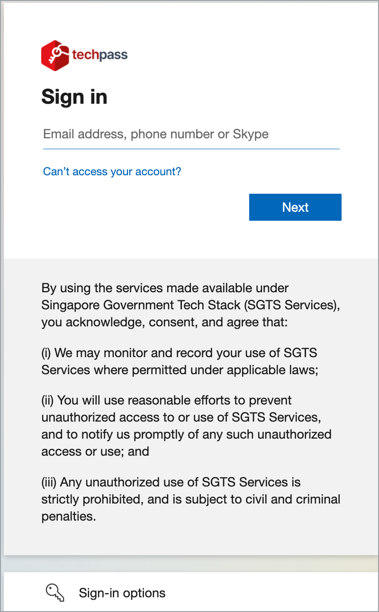

# Enrol your macOS on Cloudflare using WARP client

**Prerequisites:**

1. Ensure  that you have completed the following:

  i. [Get your macOS device managed by Intune Company Portal app](#get-your-macos-device-managed-by-intune-company-portal-app).

  ii. [Ensure SIP is enabled on your device](#ensure-sip-is-enabled-on-your-device).

  iii. [Ensure your device hard disk is encrypted](#ensure-your-device-hard-disk-is-encrypted).

  iv. [Enable Full Disk Access(FDA)](#enable-full-disk-access-fda).

2. Ensure that you have Cloudflare WARP client installed in your device. If not install it from [Clouhttps://install.appcenter.ms/orgs/cloudflare/apps/1.1.1.1-macos-1/distribution_groups/release](Clouhttps://install.appcenter.ms/orgs/cloudflare/apps/1.1.1.1-macos-1/distribution_groups/release)

3. Disconnect from any other VPN that might be running as that could clash with Cloudflare.

*To enrol macOS on Cloudflare using WARP client* :

1. Open the Cloudflare WARP client from the menu bar on the top right corner of your Mac device.

?> Tip: You can also click ``Command+Space`` and search for  **Cloudflare WARP** application to open it.-->

You will see the information page, followed by your privacy policy.

2. Click **Next** and then **Accept**.

4. When prompted to sign in, select **Azure AD – TechPass Prod**.

?> Note: If you encounter an error stating that user account does not exist in the respective tenant, open a new tab and go to [https://myaccount.microsoft.com](https://myaccount.microsoft.com/), sign out from your account and then retry.

5. Choose the appropriate login credentials to sign in with two-factor authentication:
 - If you are a public officer, use your WOG ID.
 - If you are a vendor, use your TechPass ID.:

 <!--When greeted with the Microsoft sign-in page, sign in using your WOG ID (i.e. [your\_name@tech.gov.sg](mailto:your_name@tech.gov.sg)) if you are a public officer, or your TechPass ID (i.e. [your\_name@techpass.gov.sg](mailto:your_name@techpass.gov.sg)) if you are a vendor.-->

6. Once you have successfully signed in, click the Cloudflare WARP icon.

The following screen is displayed.

?> Note: If you need to connect to a different VPN, disconnect and quit from the WARP client.

- [Download and install Cloudflare WARP Client](https://install.appcenter.ms/orgs/cloudflare/apps/1.1.1.1-macos-1/distribution_groups/release) for macOS.
