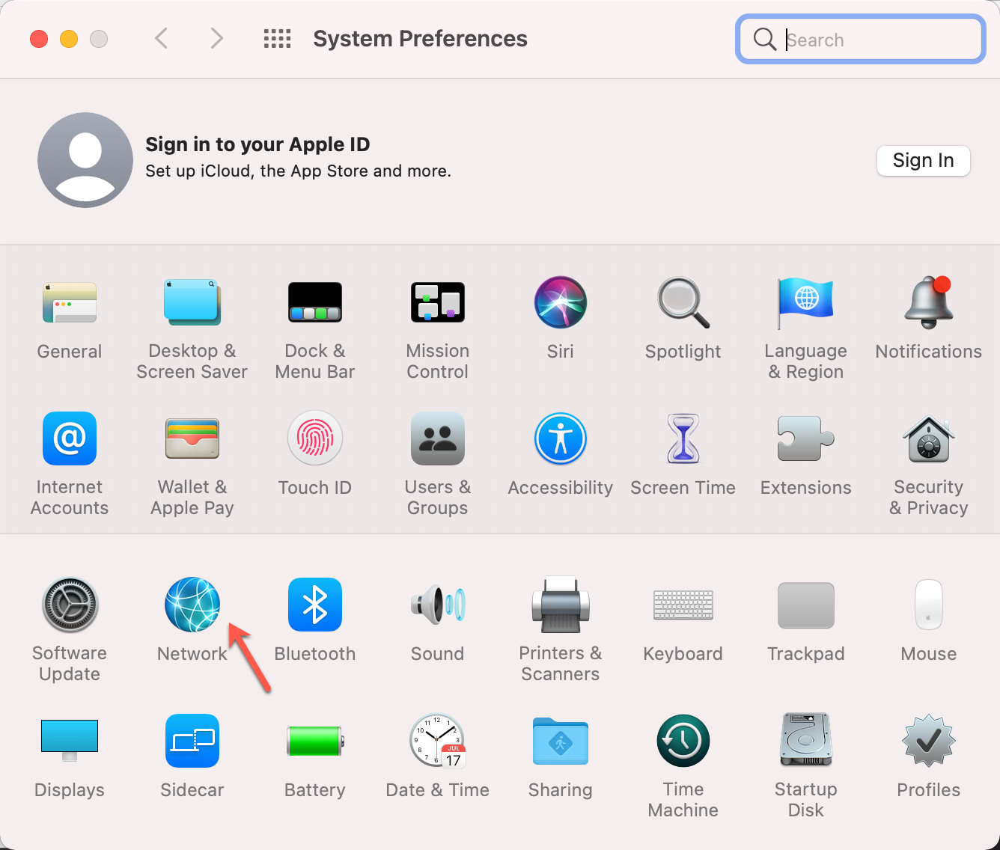
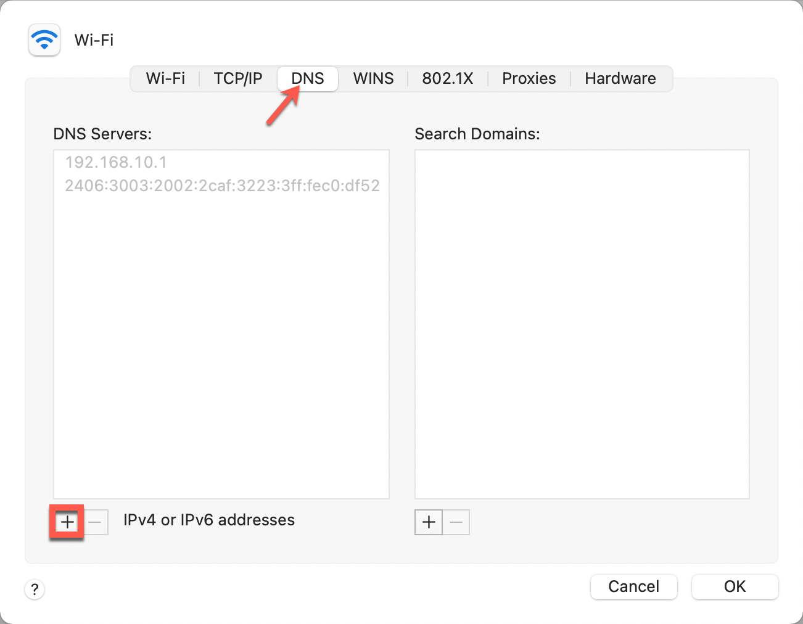
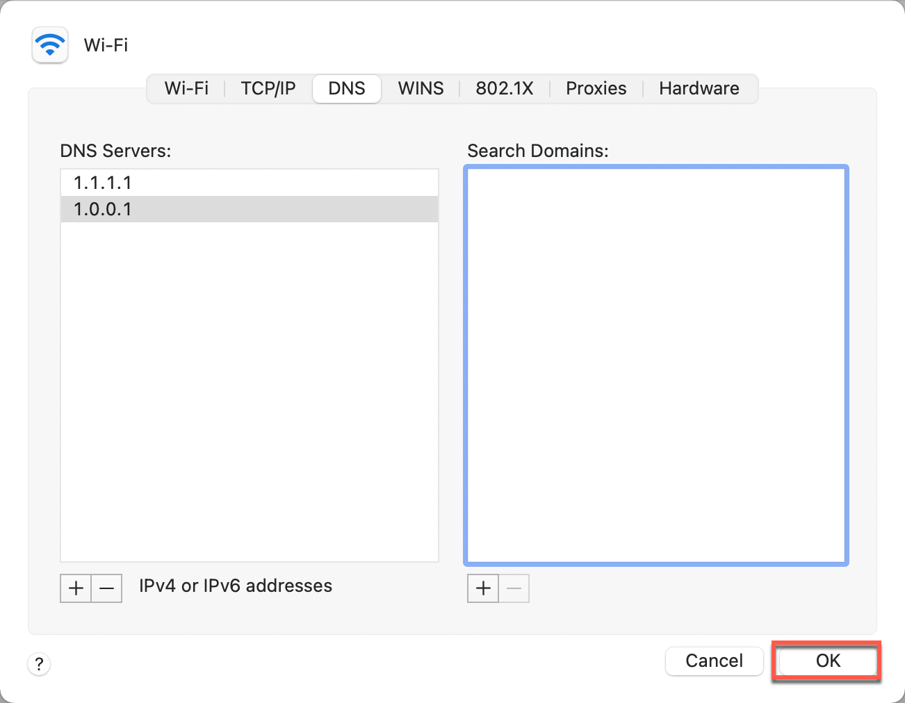
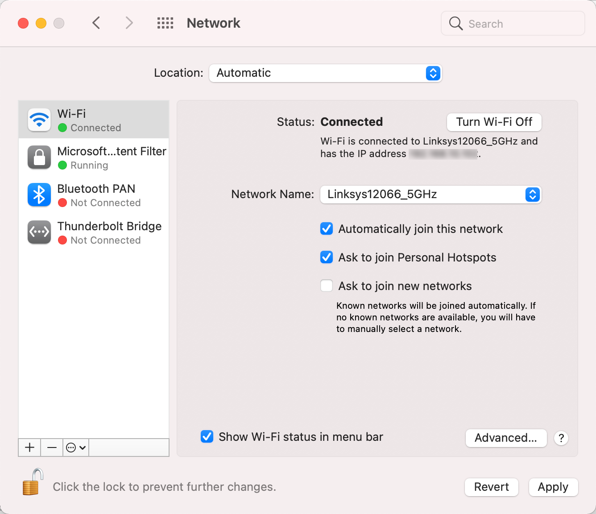

## Cloudflare WARP faq

1. Though my VPN is connected, I am unable to browse the Internet once my WARP reconnects?

If you disconnect WARP on your device, it gets automatically reconnected after three hours. At that time, if you are still connected to your VPN, you may not be able to access the internet as this conflicts with your DNS resolver configuration.

To resolve this, disconnect the device from your WiFi and reconnect it to your WiFi to reset the DNS resolver settings or restart your device.   In addition, make sure the VPN configuration does not route all traffic and DNS queries to the VPN server. Our recommendation is not to turn on WARP and the VPN at the same time.

     

2. I am unable to access a particular website. I get an <em>Access restricted</em> error or <em>DNS error</em> while accessing a website.

The following can cause this issue:

- Gateway may have blocked these sites as WARP works with Cloudflare Gateway to block websites that are identified as malware sources or a security risk as per our security policy.

- DNS resolution for the website may fail because of WARP and Gateway.

*To resolve gateway issues for trusted sites* :

1. Turn off WARP.
2. Ensure Microsoft Defender is running to protect your device against malware.

?> Note WARP connection will automatically reconnect after three hours.

*To resolve DNS error for your device* :

macOS

1. Go to **Apple** menu > **System Preferences** > **Network**.

<kbd>

2. Select **Wi-Fi** from the left pane and click **Advanced**.

?> If the lock icon at the lower left appears locked, click it to unlock the preference pane.

<kbd>

3. Go to the **DNS tab** and click the plus icon.

<kbd>

4. Enter 1.1.1.1 and click the plus icon again.

<kbd>

5. Enter 1.0.0.1 and click **OK**.

<kbd>

6. Click **Apply**

<kbd>

7. Restart your browser and verify if you can access the SEED-trusted websites such as GCC 2.0 CMP and any secured public website.
8. If you still cannot access SEED-trusted websites, raise a [support request](https://form.gov.sg/6099efa30d6a0a0012dff367).

 

Windows

1. Select **Start** > **Settings** > **Network & Internet**.

<kbd></kbd>

2. In the **Status** page, under **Advanced network settings** , select **Change adapter options**. The **Network Connections** page is displayed.
3. Right-click **Wi-Fi** and select **Properties**.

<kbd></kbd>

4. Select **Internet Protocol Version 4(TCP/IPv4)** and click **Properties**.

<kbd></kbd>

5. In the **General** tab, select **Use the following DNS server addresses**.

<kbd></kbd>

?> Note down your existing settings for future reference.

6. Enter **1.1.1.1** as **Preferred DNS server** and **1.0.0.1** as **Alternate DNS server** addresses.

<kbd></kbd>

7. Click **OK** and exit the window.
8. Restart your browser and verify if you can access the SEED-trusted websites such as GCC 2.0 CMP and any secured public website.
9. If you still cannot access SEED-trusted websites, raise a support request.

     

 
Your CLI tool may be using a certificate store that is separate from your system's trusted root certificate store.

 <ol>
   <li>Download the Cloudflare CA Certificate to your root system store(s) from the <a href="https://developers.cloudflare.com/cloudflare-one/connections/connect-devices/warp/install-cloudflare-cert#base-operating-system">Cloudflare documentation page</a>.</li>
   <li>Refer to your CLI tool's documentation and configure it to trust the Cloudflare Root certificate.</li>

   Alternatively, refer to instructions for [configuring commonly used developer CLI tools across Singapore Government developers](configuration-of-common-developer-cli-tools-with-cloudflare-warp), or  [Cloudflare instructions for configuring commonly used developer CLI tools](https://developers.cloudflare.com/cloudflare-one/connections/connect-devices/warp/install-cloudflare-cert/#adding-to-applications).

</li>
   </ol>
   

      

4.  I am unable to access the GCC 2.0 Cloud Management Portal, or a Singapore Tech Stack service. Is there a problem with my Government Managed Device?

If you are unable to access the GCC 2.0 CMP or a SGTS service, confirm the following before raising a [Support Request](https://form.gov.sg/6099efa30d6a0a0012dff367). For more information, see [Incident support request](raise-an-incident-support-request).

**confirm**:
1. You have received the successfully onboarded email from DEEP.
2. You are using only the [supported browsers](best-practices).
3. Cloudflare WARP is connected and in its settings, **Gateway with WARP** is selected.
4. Tanium is listed in the **Start** menu for Windows and in **Finder** > **Applications** for macOS.
5. Device operating system is updated to the latest version.
6. Defender ATP is up-to-date and in the running state.
7. Your TechPass account has the required permissions to access the GCC 2.0 CMP or a particular SGTS service.

In addition, make sure the VPN configuration does not route all traffic
and DNS queries to the VPN server. Our recommendation is not to turn on
WARP and the VPN at the same time.

3. While using some tools and applications with Cloudflare WARP Client, why do I get SSL errors?

Your tool or application may be using a certificate store that is
separate from your system's trusted root certificate store.

1. Download the Cloudflare CA Certificate to your root system store(s)
   from the [Cloudflare documentation
   page][install-cloudflare-cert-operating-system].
2. Refer to your CLI tool documentation and configure it to trust the
   Cloudflare Root certificate.</li>
3. You can also refer to the following links for instructions to
   configure your tool or application:

* [Our instructions for commonly used CLI tools across Singapore
  Government developers][config-cli-tools-with-warp], or
* [Cloudflare instructions for configuring commonly used developer CLI
  tools][install-cloudflare-cert-applications].

4.  I am unable to access the GCC 2.0 Cloud Management Portal, or Singapore Tech Stack Service (e.g. SHIP-HATS) Portal, is there a problem with my Government Managed Device?

SEED uses TechPass, Cloudflare Access and DEEP to ensure you and your
GMD is authorized to access the GCC 2.0 CMP or SGTS service. Please
follow these instructions to troubleshoot if you are having problems
accessing the GCC 2.0 CMP or SGTS service.

1. Ensure that you have received the DEEP onboarding email that marks
   you as onboarded.
2. Ensure that you are using Google Chrome or Microsoft Edge. Mozilla
   Firefox will need to be configured to trust your system's trusted
   root certificate store. Safari is not supported.
3. Ensure Cloudflare WARP is connected and is set to "Gateway with
   WARP".
4. Ensure that Tanium is present on your device. Check that it is listed
   in the Windows Start Menu or macOS Finder Applications folder.
5. Ensure that your device's operating system is patched to the latest
   version, and that Defender ATP is also up-to-date and running on your
   system.
6. Ensure that your TechPass account has been granted the correct
   permissions to access the GCC 2.0 CMP or SGTS service.

If you continue to have issues accessing the GCC 2.0 CMP or SGTS
service, please follow our
[instructions to raise a SEED Support Request][raise-support-request].

[raise-support-request]: ../raise-an-incident-support-request.md
[install-cloudflare-cert-operating-system]: https://developers.cloudflare.com/cloudflare-one/connections/connect-devices/warp/install-cloudflare-cert/#add-the-certificate-to-your-system
[config-cli-tools-with-warp]: ../configuration-of-common-developer-cli-tools-with-cloudflare-warp.md
[install-cloudflare-cert-applications]: https://developers.cloudflare.com/cloudflare-one/connections/connect-devices/warp/install-cloudflare-cert/#adding-to-applications
