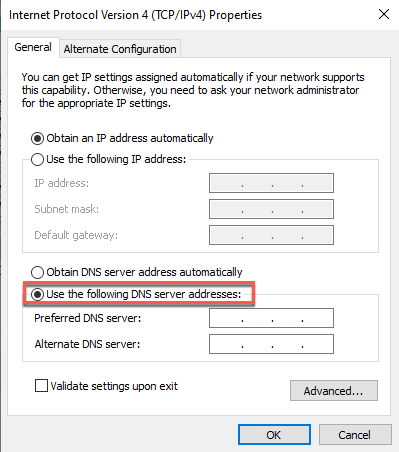

# Cloudflare WARP FAQ

1. What should I do if I am unable to browse the internet using Cloudflare WARP?

Check if you are connected to any VPN. If you are still connected to your VPN, you may not be able to access the internet as it conflicts with your DNS resolver configuration. To resolve this, disconnect from your VPN and make sure only Cloudflare WARP is connected.

     

2. I had to use my VPN and as recommended by SEED, I had turned off Cloudflare WARP and connected to VPN. After three hours, when Cloudflare WARP automatically reconnects, I am unable to browse the internet. What could be the reason and how to resolve it?

If you disconnect Cloudflare WARP on your device, it gets automatically reconnected after three hours. At that time, if you are still connected to your VPN, you may not be able to access the internet as it conflicts with your DNS resolver configuration.

To resolve this, disconnect the device from your WiFi and reconnect it to your WiFi to reset the DNS resolver settings or restart your device.

In addition, make sure the VPN configuration does not route all traffic and DNS queries to the VPN server. Our recommendation is not to turn on WARP and the VPN at the same time.

     

3. I am unable to access a particular website. I get an <em>Access restricted</em> error or <em>DNS error</em> while accessing this website.

The following can cause this issue:

- Gateway may have blocked these sites as WARP works with Cloudflare Gateway to block websites that are identified as malware sources or a security risk as per our security policy.

- DNS resolution for the website may fail because of WARP and Gateway.

*To resolve gateway issues for trusted sites* :

1. Turn off WARP.
2. Ensure Microsoft Defender is running to protect your device against malware.

?> Note WARP connection will automatically reconnect after three hours.

*To resolve DNS error for your device* :

macOS

1. Go to **Apple** menu > **System Preferences** > **Network**.

<kbd></kbd>

2. Select **Wi-Fi** from the left pane and click **Advanced**.

?> If the lock icon at the lower left appears locked, click it to unlock the preference pane.

<kbd></kbd>

3. Go to the **DNS tab** and click the plus icon.

<kbd></kbd>

4. Enter 1.1.1.1 and click the plus icon again.

<kbd></kbd>

5. Enter 1.0.0.1 and click **OK**.

<kbd></kbd>

6. Click **Apply**

<kbd></kbd>

7. Restart your browser and verify if you can access the SEED-trusted websites such as GCC 2.0 CMP and any secured public website.
8. If you still cannot access SEED-trusted websites, raise a [Support Request][raise-support-request].

 

Windows

1. Select **Start** > **Settings** > **Network & Internet**.

<kbd></kbd>

2. In the **Status** page, under **Advanced network settings** , select **Change adapter options**. The **Network Connections** page is displayed.
3. Right-click **Wi-Fi** and select **Properties**.

<kbd></kbd>

4. Select **Internet Protocol Version 4(TCP/IPv4)** and click **Properties**.

<kbd></kbd>

5. In the **General** tab, select **Use the following DNS server addresses**.

<kbd></kbd>

?> Note down your existing settings for future reference.

6. Enter **1.1.1.1** as **Preferred DNS server** and **1.0.0.1** as **Alternate DNS server** addresses.

<kbd></kbd>

7. Click **OK** and exit the window.
8. Restart your browser and verify if you can access the SEED-trusted websites such as GCC 2.0 CMP and any secured public website.
9. If you still cannot access SEED-trusted websites, raise a [support-request][raise-support-request].

     

4. While using some tools and applications with Cloudflare WARP Client, why do I get SSL errors?

Your tool or application may be using a certificate store that is separate from the trusted root certificate store of your system.

  1. Download the Cloudflare CA certificate to your root system store(s) from the [Cloudflare documentation page][install-cloudflare-cert-operating-system].
  2. Refer to your CLI tool documentation and configure it to trust the Cloudflare root certificate.
  3. You can also refer to the following links for instructions to configure your tool or application:
     * [GovTech instructions for commonly used CLI tools across Singapore
       Government developers][config-cli-tools-with-warp], or
     * [Cloudflare instructions for configuring commonly used developer CLI
       tools][install-cloudflare-cert-applications].

5.  I am unable to access the GCC 2.0 Cloud Management Portal, or a Singapore Tech Stack service. Is there a problem with my Government Managed Device?

If you are unable to access the GCC 2.0 CMP or a SGTS service, confirm the following. If your answer is "Yes" for all these queries, raise an [incident support request](raise-support-request) and [upload the diagnostic file to it]().

*Confirm the following* :
1. If you have received the successfully onboarded email from DEEP.
2. If you are using only the [supported browsers](best-practices).
3. Ensure that Cloudflare WARP client is updated to the latest version and is connected. Go to Cloudflare WARP **Settings**, and ensure that **Gateway with WARP** is selected.
4. If Tanium is listed in the **Start** menu for Windows and in **Finder** > **Applications** for macOS.
5. If your device operating system is updated to the latest version.
6. If Defender is up-to-date and in the running state.
7. If your TechPass account has the required permissions to access the GCC 2.0 CMP or a particular SGTS service.

In addition, make sure the VPN configuration does not route all traffic
and DNS queries to the VPN server. Our recommendation is not to turn on
WARP and the VPN at the same time.

If you are still having issues accessing the GCC 2.0 CMP or SGTS
service, raise a [Support Request][raise-support-request].

[raise-support-request]: support-channels.md
[install-cloudflare-cert-operating-system]: https://developers.cloudflare.com/cloudflare-one/connections/connect-devices/warp/install-cloudflare-cert/#add-the-certificate-to-your-system
[config-cli-tools-with-warp]: faqs/configuration-of-common-developer-cli-tools-with-cloudflare-warp
[install-cloudflare-cert-applications]: https://developers.cloudflare.com/cloudflare-one/connections/connect-devices/warp/install-cloudflare-cert/#adding-to-applications
