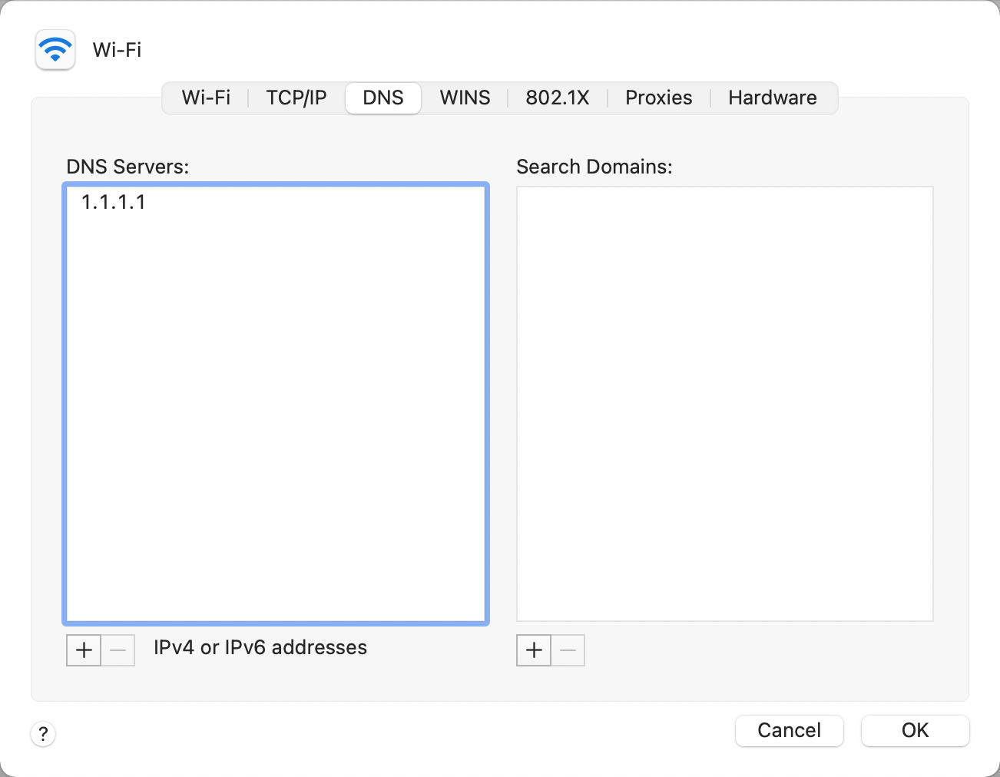
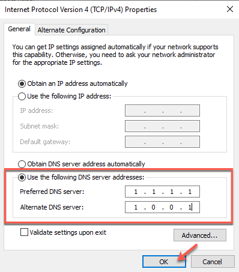

## Cloudflare WARP faq

<details>
  <summary>1. Though my VPN is connected, I am unable to browse the Internet once my WARP reconnects?</summary>

<p>If you disconnect WARP on your device, it gets automatically reconnected after three hours. At that time, if you are still connected to your VPN, you may not be able to access the internet as this conflicts with your DNS resolver configuration.</p>

<p>To resolve this, disconnect the device from your WiFi and reconnect it to your WiFi to reset the DNS resolver settings or restart your device. <br><br>In addition, make sure the VPN configuration does not route all traffic and DNS queries to the VPN server. Our recommendation is not to turn on WARP and the VPN at the same time.</p>
</details>
     <hr />

<details>
<summary>2. I am unable to access a particular website. I get an <em>Access restricted</em> error or <em>DNS error</em> while accessing a website.</summary>

<p>The following can cause this issue:</p>

- Gateway may have blocked these sites as WARP works with Cloudflare Gateway to block websites that are identified as malware sources or a security risk as per our security policy.

- DNS resolution for the website may fail because of WARP and Gateway.

*To resolve Gateway issues for trustes sites* :

1. Turn off WARP.
2. Ensure Microsoft Defender is running to protect your device against malware.

?> Note WARP connection will automatically reconnect after three hours.

*To resolve DNS error for your device* :

<details><summary>macOS</summary>

1. Go to **Apple** menu > **System Preferences** > **Network**.

<kbd>

2. Select **Wi-Fi** from the left pane and click **Advanced**.

?> If the lock icon at the lower left appears locked, click it to unlock the preference pane.

<kbd>

3. Go to the **DNS tab** and click the plus icon.

<kbd>

4. Enter 1.1.1.1 and click the plus icon again.

<kbd>

5. Enter 1.0.0.1 and click **OK**.

<kbd>

6. Click **Apply**

<kbd>

7. Restart your browser and verify if you can access the SEED-trusted websites such as GCC 2.0 CMP and any secured public website.
8. If you still cannot access SEED-trusted websites, raise a [support request](https://form.gov.sg/6099efa30d6a0a0012dff367).
</details><br>

<details><summary>Windows</summary>

1. Select **Start** > **Settings** > **Network & Internet**.

<kbd></kbd>

2. In the **Status** page, under **Advanced network settings** , select **Change adapter options**. The **Network Connections** page is displayed.
3. Right-click **Wi-Fi** and select **Properties**.

<kbd></kbd>

4. Select **Internet Protocol Version 4(TCP/IPv4)** and click **Properties**.

<kbd></kbd>

5. In the **General** tab, select **Use the following DNS server addresses**.

<kbd></kbd>

?> Note down your existing settings for future reference.

6. Enter **1.1.1.1** as **Preferred DNS server** and **1.0.0.1** as **Alternate DNS server** addresses.

<kbd></kbd>

7. Click **OK** and exit the window.
8. Restart your browser and verify if you can access the SEED-trusted websites such as GCC 2.0 CMP and any secured public website.
9. If you still cannot access SEED-trusted websites, raise a support request.
</details>


</details>
     <hr />

<details>
 <summary>3. While using CLI tools with Cloudflare WARP Client why do I get SSL errors?</summary>

 <p>Your CLI tool may be using a certificate store that is separate from your system's trusted root certificate store.</p>

 <ol>
   <li>Download the Cloudflare CA Certificate to your root system store(s) from the <a href="https://developers.cloudflare.com/cloudflare-one/connections/connect-devices/warp/install-cloudflare-cert#base-operating-system">Cloudflare documentation page</a>.</li>
   <li>Refer to your CLI tool's documentation and configure it to trust the Cloudflare Root certificate.</li>

   Alternatively, refer to instructions for [configuring commonly used developer CLI tools across Singapore Government developers](configuration-of-common-developer-cli-tools-with-cloudflare-warp), or  [Cloudflare instructions for configuring commonly used developer CLI tools](https://developers.cloudflare.com/cloudflare-one/connections/connect-devices/warp/install-cloudflare-cert/#adding-to-applications).

</li>
   </ol>
   </details>
      <hr />

<details>
<summary>4.  I am unable to access the GCC 2.0 Cloud Management Portal, or a Singapore Tech Stack service. Is there a problem with my Government Managed Device?</summary>

If you are unable to access the GCC 2.0 CMP or a SGTS service, confirm the following before raising a [Support Request](https://form.gov.sg/6099efa30d6a0a0012dff367). For more information, see [Incident support request](raise-an-incident-support-request).

**confirm**:
1. You have received the successfully onboarded email from DEEP.
2. You are using only the [supported browsers](best-practices).
3. Cloudflare WARP is connected and in its settings, **Gateway with WARP** is selected.
4. Tanium is listed in the **Start** menu for Windows and in **Finder** > **Applications** for macOS.
5. Device operating system is updated to the latest version.
6. Defender ATP is up-to-date and in the running state.
7. Your TechPass account has the required permissions to access the GCC 2.0 CMP or a particular SGTS service.


</details>
<!--

Why am I unable to use my CLI tools such as NPM, Docker and the
   AWS CLI tool with WARP?

   Visit [Cloudflare CLI tools configurations](https://gitlab-in.ship.gov.sg/gcc2.0/seed/cloudflare-support/-/blob/master/cloudflare-cli-tools-configuration.md) for instructions on how to configure applications and CLI tools to work with WARP.


4. When using Cloudflare WARP Client

   * We are finetuning the configuration of Cloudflare Gateway rules to
     Do Not Inspect the Do Not Decrypt group of Applications.
   * Despite having this rule, we are having users report that NPM,
     Docker and the AWS CLI are still raising SSL certificate
     verification errors

4. Users are unable to resolve the DNS services of resources behind the
   SHIP OpenVPN with WARP connected.
   * We demonstrated to Antonio during the POC period that queries for
     SHIP service hostnames were not resolving, even with the SHIP
     service hostnames being in the domain exclusion list and the SHIP
     internal DNS server IP Addresses being in the split tunnel list
   * Antonio is still trying to replicate this issue on his end.
   * The workaround to configure Cloudflare DNS to override responses
     for SHIP service hostnames is working presently, but this solution
     is unscalable as we will be onboarding Developers from across the
     Whole of Government with their own VPNs


### When using Cloudflare WARP Client together with SHIP OpenVPN client, users are unable to visit SHIP services.

When the WARP client and SHIP OpenVPN are connected, DNS requests are
not being sent to SHIP DNS to resolve SHIP Service URLs. We have
presently worked around this by configuring DNS request overrides
returned by Cloudflare.


### When using Cloudflare WARP Client together with SHIP OpenVPN/CheckPoint VPN client on WiFi, users are disconnected from the Internet when switching WARP on or off, or when connecting or disconnecting from the VPN.

We have observed that this occurs after a specific order of events:
1. User disconnects WARP Client
2. User connects to VPN Client
3. WARP Client reconnects after 60 minutes
4. Operating System DNS is altered by VPN and WARP Clients, resulting in
   no Internet.


If this is happening to you, please help report the issue to us, using
the template above and submitting logs and screenshots. Please follow
the section on Collecting Logs and telemetry for Cloudflare WARP and
your VPN client, then follow the section on Restoring Internet
connectivity to your endpoint.


### When using Cloudflare WARP Client, users are unable to visit some public websites on the Internet

Occasionally Cloudflare may fail to resolve public websites on the
Internet. This occurs randomly and quickly resolves itself, so it is
hard to catch. If you do catch it, please follow the section on
Collecting Logs and telemetry for Cloudflare WARP and collect nslookup
output to send to us through the issue tracker.


## Workarounds


### Restoring WiFi Internet Connectivity

For Windows, please refer to the following guide to restore Internet
connectivity:
https://support.microsoft.com/en-us/windows/fix-wi-fi-connection-issues-in-windows-9424a1f7-6a3b-65a6-4d78-7f07eee84d2c

* Flush your DNS Cache by running the following command:

  ```cmd
  ipconfig /flushdns
  ```


    ```
    sudo dscacheutil -flushcache; sudo killall -HUP mDNSResponder
    ```

  


* Repair your Network Adapter

For Windows:
1. Right click the Wireless icon in the System Tray
   

2. Click on Troubleshoot problems

   

3. Follow the wizard to reset your Wireless network adapter.

   

* Reboot your Laptop

  If none of the steps above work to restore Internet Connectivity,
  please reboot your device.


-->
