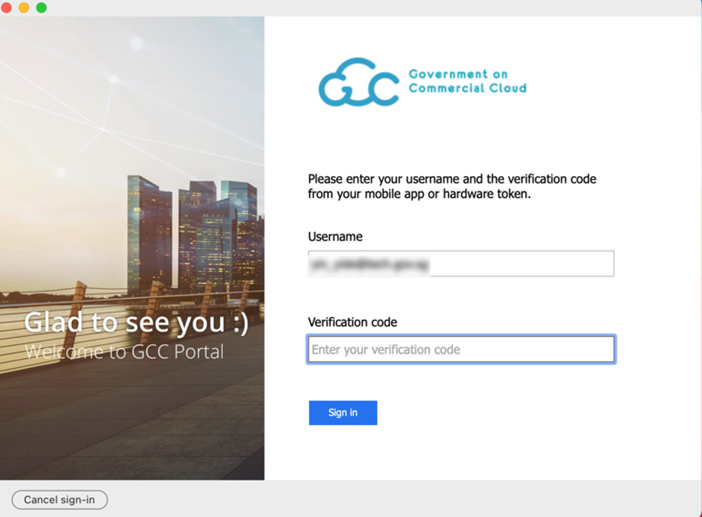

# Offboard your device from SEED

This page tells you how to offboard your device from SEED.

<!-- tabs:start -->

### **macOS**

<details>
  <summary>a. Remove your device from Microsoft Intune</summary>

  1. Open the **Company Portal** application and click **Sign in**.

  <kbd></kbd>

  2. Log in using your TechPass account credentials.
     <!--- If you are a public officer, use your [WOG ID](terms-definitions).
     - If you are a vendor, use your [TechPass ID](terms-definitions).-->

     <kbd></kbd>

     ?> Your two-factor authentication(2FA) varies based on the authentication method you have [set up](https://account.activedirectory.windowsazure.com/Proofup.aspx). If you're using the text message method for authentication, after you enter your password, enter the verification code sent to your phone.

  3. Go to **Devices** and click the three dots beside the device you want to unenrol.
  4. Choose **Remove**.

  <kbd></kbd>
  5. When prompted to confirm the removal, select **Remove**.
  6. Click your profile icon and **Sign out** of **Company Portal**.


</details>

<details>
  <summary>b. Remove Tanium Client</summary>

  1. Open the **Terminal** app and run the following commands:

  ```
  sudo launchctl unload /Library/LaunchDaemons/com.tanium.taniumclient.plist

  sudo launchctl remove com.tanium.taniumclient > /dev/null 2>&1

  sudo rm /Library/LaunchDaemons/com.tanium.taniumclient.plist

  sudo rm /Library/LaunchDaemons/com.tanium.trace.recorder.plist

  sudo rm -rf /Library/Tanium/

  sudo rm /var/db/receipts/com.tanium.taniumclient.TaniumClient.pkg.bom

  sudo rm /var/db/receipts/com.tanium.taniumclient.TaniumClient.pkg.plist

  sudo rm /var/db/receipts/com.tanium.tanium.client.bom

  sudo rm /var/db/receipts/com.tanium.tanium.client.plist
  ```
2. Enter your macOS password when prompted.  

</details>

<details>
  <summary>c. Remove Cloudflare WARP client</summary>

  Complete the following steps to remove Cloudflare WARP Client:

  1. Open the **Terminal**app and run the following command.

  ```
  sudo /bin/sh /Applications/Cloudflare\ WARP.app/Contents/Resources/uninstall.sh
  ```
  2. Enter your macOS password when prompted.

  </details>

  <details>
  <summary>d. Remove Microsoft Defender for Endpoint</summary>

To remove Microsoft Defender for Endpoint from your device, offboard your device from it using the offboarding script.

1. Open **Terminal** and run `mdatp health`.
2. Note down the displayed **org_id**.
3. Identify the organisation of the Defender or the antivirus on your device.

?> Refer to [Organisation IDs and organisation mapping](faqs/organisation-ids-and-mapping.md) for identifying your Defender or antivirus organisation.

4. Based on the organisation, choose the required step from the following:
  - If your organisation id corresponds to WOG, contact [GCC2.0 team](https://form.gov.sg/#!/6099efa30d6a0a0012dff367), to get the offboarding script for macOS.
  - If your organisation id corresponds to TechPass, contact your Defender administrator to get the offboarding scripts for your operating system for macOS.

?>  Check if the script that you received has not yet expired. The expiry date is indicated on the file name. For example, *WindowsDefenderATPOffboardingScript_valid_until_2021-11-10.py*

5. Save the offboarding script to the **Downloads** folder.
6. Go to **Terminal** and run the following command:
  ```
  sudo /bin/sh ~/Downloads/name_of_offboarding_script.sh
  ```
?> The file name *name_of_offboarding_script* in this command is only an example. When you run the command, specify the file name of the offboarding script provided to you.

7. Go back to the **Finder** icon in the **Dock**.
8. Choose **Applications** and search for **Microsoft Defender for Endpoint.app**.
9. Drag the app to the Bin, or select the app and choose **File** > **Move to Bin**.

</details>

### **Windows**

<details>
<summary>a. Remove your  device from Microsoft Intune</summary>

1. Click **Start** icon on the taskbar.
2. Go to  **Settings** > **Accounts** > **Access work or school**.
3. Click your account and select **Disconnect**.
</details>

<details>
<summary>b. Remove the Tanium Client</summary>

1. Click **Start** icon on the taskbar.
2. Go to **Settings** > **Apps**.
3. Search for **Tanium Client** and then select **Uninstall**

</details>

<details>
<summary>c. Remove the Cloudflare WARP client</summary>

1. Click **Start** icon on the taskbar.
2. Go to **Settings** > **Apps**.
3. Search for **Cloudflare WARP** and then select **Uninstall**.
</details>

<details>
<summary>d. Remove Microsoft Defender for Endpoint</summary>

To remove Microsoft Defender for Endpoint from your device, offboard the device from it using the offboarding script.

  1. In the search box on the taskbar, type **regedit**.
  2. Choose **Registry Editor** from the results and click **Run as administrator**.
  3. In the **Registry Editor**, go to **Computer** > **HKEY_LOCAL_MACHINE** > **SOFTWARE** > **Microsoft** > **Windows Advanced Threat Protection** > **Status**. The OrgId of the Defender or antivirus running on your device will be displayed here.
  4. Identify the organisation of the Defender or the antivirus on your device.

  ?> Refer to [Organisation IDs and organisation mapping](faqs/organisation-ids-and-mapping) for identifying your Defender or antivirus organisation.

  5. Based on the organisation, choose the required step from the following:
    - If your organisation id corresponds to WOG, contact [GCC2.0 team](https://form.gov.sg/#!/6099efa30d6a0a0012dff367), to get the offboarding script for Windows.
    - If your organisation id corresponds to TechPass, contact your Defender administrator to get the offboarding scripts for your operating system for Windows.

    ?>  Check if the script that you received has not yet expired. The expiry date is indicated on the file name. For example, *WindowsDefenderATPOffboardingScript_valid_until_2021-11-10.cmd*


   6. Save the offboarding script in your **Downloads** folder.
   7. Go to **Start** and type **cmd**.
   8. Right-click on **Command Prompt** and select **Run as administrator**.
   9. If prompted, enter your Windows password.
   10. Run the following commands:
     ```
     cd "%USERPROFILE%\Downloads\"

     .\name_of_offboarding_script.cmd
     ```
  ?> Name of the .cmd file mentioned in this command is only an example. When you run the command, specify the file name of the offboarding script provided to you.  

</details>

<!-- tabs:end -->
