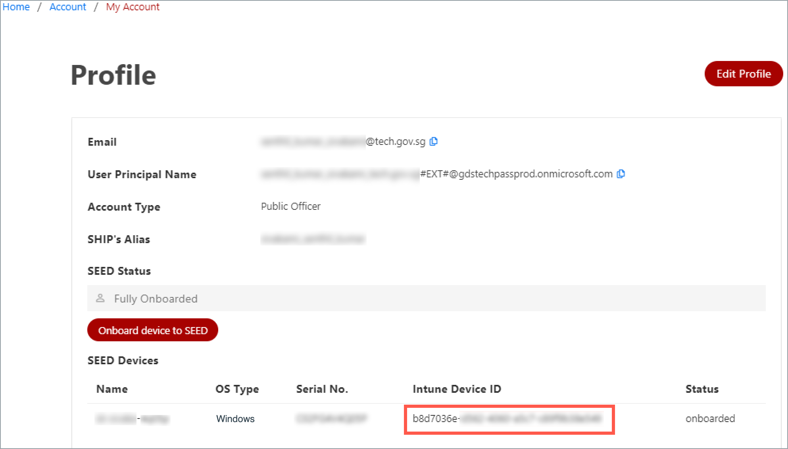
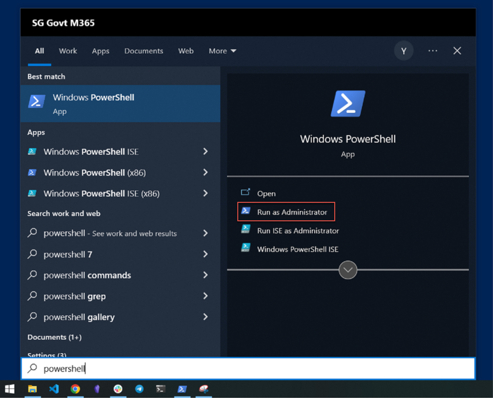

# Offboard Windows device using a script
 
This document guides you to offboard your Windows device onboarded to SEED.

## Audience

- Users who need to offboard their Windows device from SEED.

## Prerequisites

- You must have an active TechPass account.
- Your device must have been onboarded to SEED.
- [Optional] We recommend you to have your Intune Device ID ready. 

### Get Intune Device ID

Complete one of the following methods to get your Intune Device ID:

?> **Tip**<br>Click the triangle to view more details about each method.

<details>
<summary style="font-size:20px;font-weight:bold">Method 1: Get Intune Device ID from your GMD</summary>

1. Open **PowerShell** and run the following commands:

```
$rootKey = [Microsoft.Win32.RegistryKey]::OpenBaseKey(
 [Microsoft.Win32.RegistryHive]::LocalMachine,
 [Microsoft.Win32.RegistryView]::Registry64
)
$enrollmentsKey = $rootKey.OpenSubKey("Software\Microsoft\Enrollments")
$intune_id = "Intune ID not found"
foreach ($name in $enrollmentsKey.GetSubKeyNames()) {
 $enrollmentIdKey = $enrollmentsKey.OpenSubKey($name)
 if ($enrollmentIdKey.GetValue("ProviderID") -ieq "MS DM Server") {
     $intune_id = $enrollmentIdKey.OpenSubKey("DMClient\MS DM Server").GetValue("EntDMID", "Intune ID not found")
     break
 }
}
Write-Output $intune_id

```
2. Take note of the Intune Device ID that is displayed on the **Powershell** window.

</details>


<details>
<summary style="font-size:20px;font-weight:bold">Method 2: Get Intune Device ID from TechPass portal</summary>

1. On your non-SE GSIB device, go to the [TechPass portal](https://portal.techpass.gov.sg/secure/account/profile).
2. On the TechPass portal, at the top right, go to your user name and click **My Account**. Your **Profile** details are displayed. 
3. Take note of the **Intune Device ID** from the **Profile** page.



</details>

<details>
<summary style="font-size:20px;font-weight:bold">Method 3: Submit an incident request to get Intune Device ID.</summary>

?> **Note**<br>Use this method only if you can't log in to your GMD or TechPass portal.

- Submit an [incident request](https://go.gov.sg/techpass-sr) to get your Intune Device ID.

</details>

!> **Note**<br>If you have any issues with the offboarding steps, see the [Offboarding FAQs](/faqs/seed-offboarding-faqs) before submitting an [incident request](https://go.gov.sg/techpass-sr) with TechPass support.

## Phase A: Offboard device from SEED components

1. Go to the **Start** menu and enter **Powershell**.
2. Right-click on the search result for **PowerShell** and select **Run as Administrator**



3. On **Powershell**, run the following command.

```
$reg64 = [Microsoft.Win32.RegistryKey]::OpenBaseKey([Microsoft.Win32.RegistryHive]::LocalMachine, [Microsoft.Win32.RegistryView]::Registry64)
$OrgID =  $reg64.OpenSubKey("SOFTWARE\MICROSOFT\Windows Advanced Threat Protection\Status").GetValue("OrgID")
echo $OrgID
``` 


4. Take note of the value displayed for **OrgID**.


5. Refer to the following table and identify your **Defender organisation** and download the offboarding package.

  | OrgID | Defender organisation | Offboarding package |
  | ------------- |:-------------:|:-------------:| 
  | faa36a5e-2da6-4225-8e27-226177c801a0      | WOG     | [Download offboarding script](https://k3uwa66lu3tj6uxft46666ynhe0uvzor.lambda-url.ap-southeast-1.on.aws/local_wog_windows) |
  | 49237d71-42ac-425a-a803-881b92cc18ce  | TechPass    | [Download offboarding script](https://k3uwa66lu3tj6uxft46666ynhe0uvzor.lambda-url.ap-southeast-1.on.aws/local_tp_windows)    |
  | 6389e966-e334-461d-86ce-0fed12484620 | Hive | Contact [Hive support](mailto:GDS_DEN@hive.gov.sg) to get the offboarding package. |

!> **Important**<br> If your Defender organisation is neither **WOG** nor **TechPass**, contact the IT support of the organisation that provided you with the device.

6. Go to the folder where you downloaded the ZIP file and extract the files. You should see the following two files. 

    

?> **Note**: The file names vary with the organisation.

7. Right-click the unzipped folder to select **Show more options** > **Copy as path**. The folder path is now saved to your clipboard.

8. On **Powershell**, run the following command to go to the folder which has the extracted files:

    ```cd {Path from clipboard}```

    For example:

    ```cd "C:\Users\testUser\Downloads\Offboarding_local_tp_windows"```

    

10. To run the script, enter the following command:

    ```
    powershell.exe -ExecutionPolicy Bypass .\local_windows_offboarding.ps1
    ```

When you see the following success message on your **Powershell**, you are automatically directed to the **SEED offboarding: Request to remove device record** form to submit the Intune Device ID. 


!>**Important note**<br> Make sure you complete the steps in Phase B immediately after Phase A. If not, your device update policy may reinstall the latest version of the deleted SEED components.

## Phase B: Submit Intune Device ID to remove device record

### Prerequisites

- Successful completion of [Phase A: Offboard device from SEED components](#phase-a-offboard-device-from-seed-components).
- **Intune Device ID**. Generally, when you successfully offboard your device from the SEED components, the Intune Device ID is automatically displayed on the **SEED Offboarding: Device Record Removal** form. If it is not displayed, see [Get Intune Device ID](#get-intune-device-id).
- [Optional]If you have submitted an incident request with the TechPass support team to offboard your device from the SEED components, please have the reference number ready as we may need this information.

### To submit Intune Device ID

1. Ensure your **Intune Device ID** is displayed on the form. If it is not displayed, provide it.
2. Enter your organisational email address in **Organisational Email Address** and click **Verify**.
3. Enter the OTP you receive at this email address.  
4. Indicate if you had any issues while completing **Phase A**.
5. [Optional] If you had issues completing **Phase A**, we encourage you to provide the **Support Ticket Number**.
6. Click **Submit**. When this request is processed successfully, we send a notification via email.


?> **Additional information**<br>- We require up to 30 minutes to process your server-side offboarding request.<br>- If you are still waiting to receive an email after 30 minutes, please submit a [TechPass support request](https://go.gov.sg/techpass-sr).


<!--

[Get Intune Device ID](../snippets/snippets-get-intune-device-id.md ':include')

-->