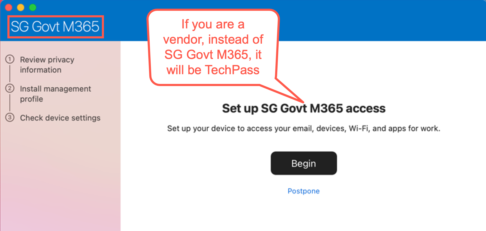
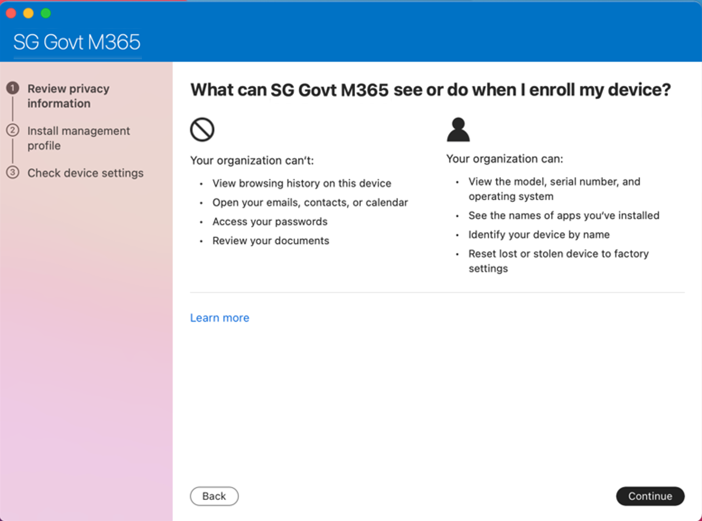
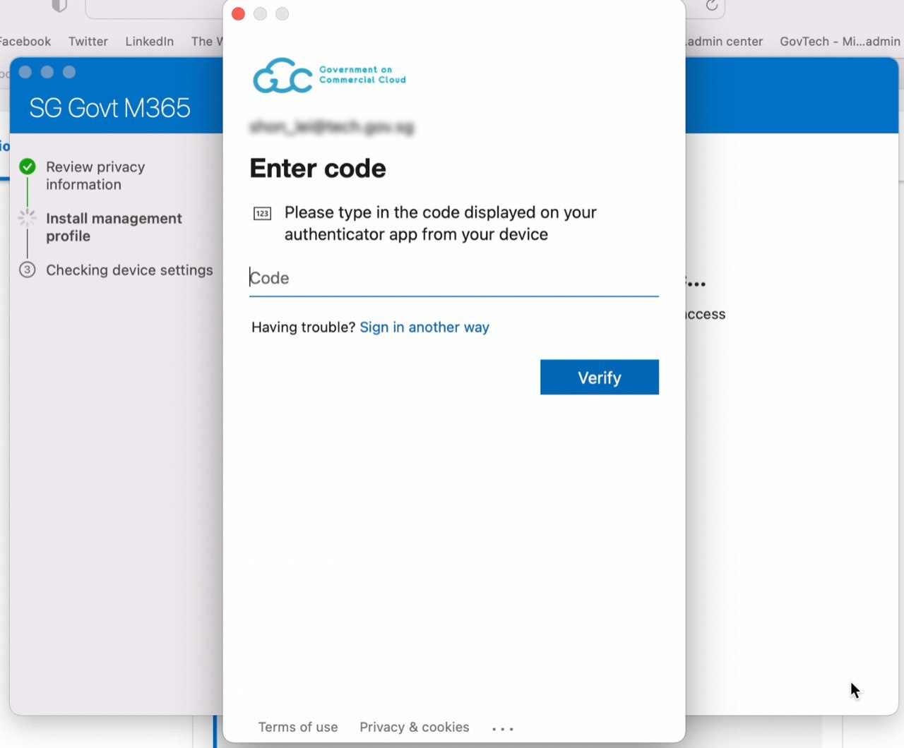
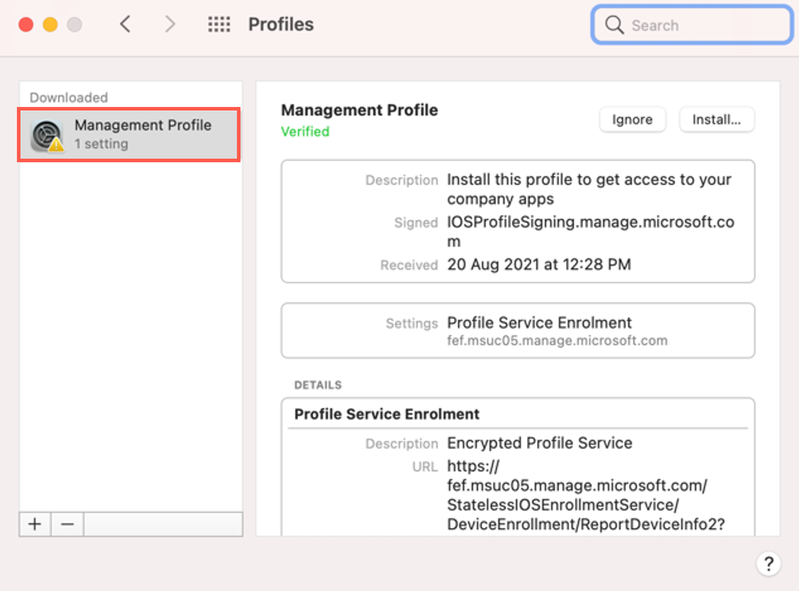
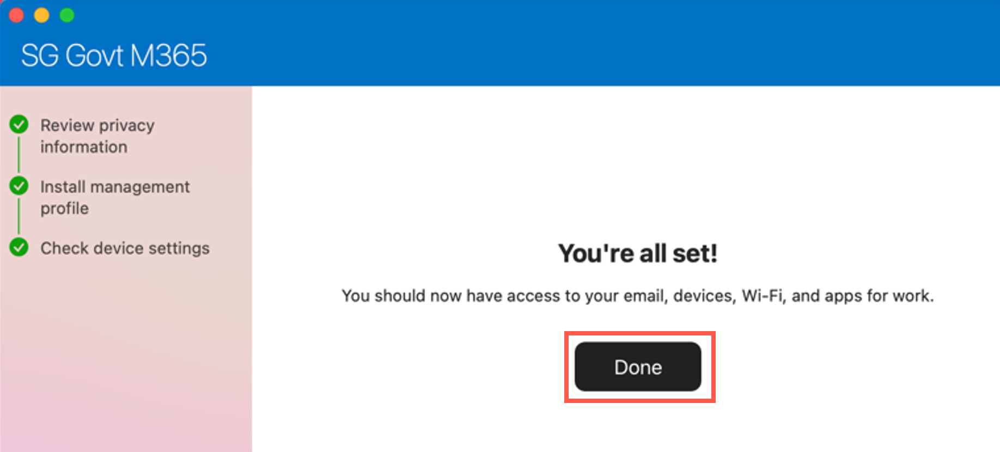

# Onboard macOS to SEED

<!-- This page is linked in the TechPass portal-Register Intune Device ID, so please do not rename this file. -->

> **Note**:
>- Based on your device settings, while onboarding, you may be prompted to restart your device a couple of times and reset device password.
>- For a smooth onboarding journey, link your Apple ID to your device.
>- Keep your recovery keys ready if you face issues in resetting your password or logging in to your device.

<ifigure>
<iframe title="YouTubeVideoPlayer" src="https://www.youtube.com/embed/P9R5RiMpaVU?showinfo=0" height="315" width="560" frameborder="0" allow="accelerometer; autoplay; encrypted-media; gyroscope; picture-in-picture" allowfullscreen></iframe>
</ifigure>


> **Note**: Please complete all the steps within the same session.

## Step 1: Set up Microsoft Intune

<details>
  <summary style="font-size:18px">Set up Microsoft Intune to get the required applications and device configuration</summary><br>

  1. Download and install [**Company Portal**](https://go.microsoft.com/fwlink/?linkid=853070).

  2. Open the **Company Portal** application and click **Sign in** to log in using your TechPass credentials.

  <kbd></kbd>

  3. Approve your TechPass login using the authenticator app that was used to set up TechPass MFA. However, if you are a public officer, approve your WOG login first by entering the verification code displayed for your SG Govt M365 profile on the authenticator app before approving your Techpass login.

  <kbd></kbd>

  ?> The above page is displayed only for public officers. Refer to [TechPass documentation](https://docs.developer.tech.gov.sg/docs/techpass-user-guide/#/) for more information.

  4. Once you have signed in, click **Begin**.

  <kbd></kbd>

  5. Review privacy information. Then click **Continue**.

  <kbd></kbd>

  6. When prompted to authenticate your WOG account, enter the verification code displayed for your SG Govt M365 profile on the authenticator app.

  <kbd></kbd>

  7. On the **Install management profile** page, click **Download profile**.

  <kbd></kbd>

  8. Follow the on-screen instructions to allow Microsoft Intune to manage your device. The **Profiles** page is displayed.

  <kbd></kbd>

  >**Tip**:
   >- If **Profiles** page is not displayed, go to the **Apple** menu > **System Preferences** > **Profiles**.
   >- If **Management Profile** is not displayed, then from the left side menu, select **Management Profile**.

  9. Click **Install** to get the required configuration profiles.

  !> If you are a public officer, complete all the substeps in [Step 2: Register the Microsoft Intune device ID for your macOS device](https://docs.developer.tech.gov.sg/docs/security-suite-for-engineering-endpoint-devices/onboard-device/mac-os?id=step-2-register-microsoft-intune-device-id-only-for-gsib-users-onboarding-their-internet-device) to get the profiles installed. 

  <kbd></kbd>

  If you are a vendor or a contractor, the required configuration profiles will be installed as shown below. If profile installation fails, refer to [Common onboarding issues for macOS users](faqs/common-onboarding-issues).

  <kbd></kbd>

  9. Open the **Company Portal** application again.

  10. You will see the success message. Click **Done**.

  <kbd></kbd>

</details>

## Step 2: Register Microsoft Intune device ID (only for GSIB users onboarding their internet device)

<details>
  <summary style="font-size:18px">Register the Microsoft Intune device ID for your macOS device</summary><br>

> **Note**:  
>
>- This step is applicable only if you have a GSIB device and your TechPass ID is the same as your organisation email address. In other words, this is applicable for users whose TechPass ID's domain **is not** ```techpass.gov.sg```.
>
>- If you only have a SE-GSIB device, complete substeps 1 and 2, and then contact the [support team](https://go.gov.sg/techpass-sr) with your Intune device ID to register your Intune device ID.  

<!--

- Skip the following steps if your TechPass ID belongs to the TechPass AAD and has its domain as *techpass.gov.sg*. For example, *peter_wilson<span>@</span>techpass.gov.sg*.

-->
1. Open **Terminal** and run the following commands:

```
intune_id="$(security find-certificate -a /Library/Keychains/System.keychain | egrep -B 4 '\"issu\"<blob>=.+MICROSOFT INTUNE MDM DEVICE CA' | grep alis | cut -d '"' -f 4)"
if [ -z "$intune_id" ]
then
    echo "Intune ID not found"
    return
fi

num_candidates="$(echo "$intune_id" | wc -l | xargs echo -n)"
if [ "$num_candidates" -eq 1 ]
then
    echo "$intune_id"
    return
fi

old_ifs="$IFS"
IFS='\n'
actual_id="Intune ID not found"
curr_latest_end_date_unix=0
while read id
do
    end_date="$(security find-certificate -c "$id" -p /Library/Keychains/System.keychain | openssl x509 -noout -enddate | cut -d '=' -f 2)"
    end_date_unix="$(date -j -f "%b %e %H:%M:%S %Y %Z" "$end_date" "+%s")"
    if [ "$end_date_unix" -ge "$curr_latest_end_date_unix" ]
    then
        actual_id="$id"
        curr_latest_end_date_unix="$end_date_unix"
    fi
done <<< "$intune_id"

IFS="$old_ifs"
echo "$actual_id"
```
2. Take note of the Intune device ID that is displayed on the Terminal window.

3. On your **non-SE GSIB** device, go to [TechPass portal](https://portal.techpass.gov.sg/secure/account/profile) > **My Account** > **Profile**.
4. Click **Onboard device to SEED** and follow the on-screen instructions to submit this Intune device ID. Intune installs the required software and configurations to complete your device onboarding.

If your onboarding is successful, within an hour, you will receive a successfully onboarded email to  your organisational email address.

5. To verify if the required profiles are installed correctly, on your macOS device, go to **System Preferences** > **Profiles**. You should be able to see the profiles listed as shown here.

<kbd></kbd>

</details>

**Next step**: Proceed to [Post onboarding steps](post-onboarding-instructions/post-onboarding-steps-and-verification).
