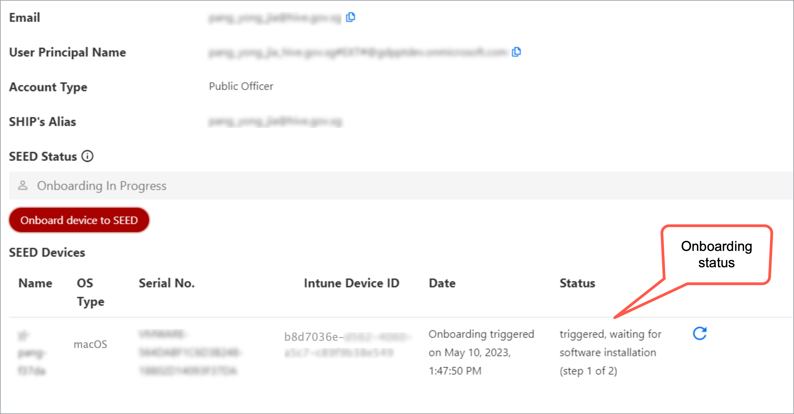

# Onboard macOS device to SEED as public officers

<!-- This page is linked in the TechPass portal-Register Intune Device ID, so please do not rename this file. -->

?> <br>- Based on your device settings, while onboarding, you may be prompted to restart your device a couple of times and reset your device password.<br>- Keep your recovery keys ready if you face issues resetting your password or logging in to your device.


<!-- 
<ifigure>
<iframe title="YouTubeVideoPlayer" src="https://www.youtube.com/embed/P9R5RiMpaVU?showinfo=0" height="640" width="960" frameborder="0" allow="accelerometer; autoplay; encrypted-media; gyroscope; picture-in-picture" allowfullscreen></iframe>
</ifigure>
-->

<div style="position:relative;padding-bottom:56.25%;padding-top:30px;height:0;overflow:hidden;">
<iframe style="position:absolute;top:0;left:0;width:100%;height:100%;" src="https://www.youtube.com/embed/P9R5RiMpaVU" title="YouTube video player" frameborder="0" allow="accelerometer; autoplay; clipboard-write; encrypted-media; gyroscope; picture-in-picture; web-share" allowfullscreen="true"></iframe>
</div>


## Step 1: Set up Microsoft Intune

<details>
  <summary style="font-size:18px">Set up Microsoft Intune to get the required applications and device configurations.</summary>

  - Go to [Microsoft Intune documentation](https://learn.microsoft.com/en-us/mem/intune/user-help/enroll-your-device-in-intune-macos-cp) and follow the instructions on this page to complete the following:

   a. Download and install Company Portal.

   b. Enroll your Mac device.

  
</details>

## Step 2: Register Microsoft Intune Device ID

<details>
  <summary style="font-size:18px">Register the Microsoft Intune Device ID for your macOS device.</summary><br>

1. Open **Terminal** and run the following commands:

```
intune_id="$(security find-certificate -a /Library/Keychains/System.keychain | egrep -B 4 '\"issu\"<blob>=.+MICROSOFT INTUNE MDM DEVICE CA' | grep alis | cut -d '"' -f 4)"
if [ -z "$intune_id" ]
then
    echo "Intune ID not found"
    return
fi

num_candidates="$(echo "$intune_id" | wc -l | xargs echo -n)"
if [ "$num_candidates" -eq 1 ]
then
    echo "$intune_id"
    return
fi

old_ifs="$IFS"
IFS='\n'
actual_id="Intune ID not found"
curr_latest_end_date_unix=0
while read id
do
    end_date="$(security find-certificate -c "$id" -p /Library/Keychains/System.keychain | openssl x509 -noout -enddate | cut -d '=' -f 2)"
    end_date_unix="$(date -j -f "%b %e %H:%M:%S %Y %Z" "$end_date" "+%s")"
    if [ "$end_date_unix" -ge "$curr_latest_end_date_unix" ]
    then
        actual_id="$id"
        curr_latest_end_date_unix="$end_date_unix"
    fi
done <<< "$intune_id"

IFS="$old_ifs"
echo "$actual_id"
```
2. Take note of the Intune Device ID that is displayed on the Terminal window.

3. Choose the appropriate method to register your Intune Device ID:

    a. If you only have a **SE GSIB** device, submit a [support request](https://go.gov.sg/seed-techpass-support) to register your Intune Device ID and skip rest of the steps. Within two hours, you should receive the successfully onboarded email. 

    b. If you have a **non-SE GSIB** device, log in to the [TechPass portal](https://portal.techpass.gov.sg/secure/account/profile).

4. On the TechPass portal, at the top right, go to your user name and click **My Account**. Your **Profile** details are displayed. 
5. Click **Onboard device to SEED** and follow the on-screen instructions to submit this Intune Device ID.

  

  You will receive the following confirmation message.

  

  Your Internet Device record is listed under the **SEED Devices** with the following details:

    - Device name
    - Operating system of the device
    - Serial number
    - Intune Device ID
    - Date and time when the onboarding was trigerred or when the device was successfully onboarded
    - Onboarding status

  

6. Ensure the device you are onboarding is connected to the Internet so that Intune is able to install the required software and configurations.

7. After 30-60 minutes, check your inbox (organisational email address) to see if you have received any email regarding your onboarding status.

8. Choose the appropriate step:

   a. If you have received a successfully onboarded email, skip rest of the steps in this section and proceed to [Step 3: Verify installation](#step-3-verify-installation).

   b. If you have received a failed onboarding email, complete the following step on [TechPass portal](https://portal.techpass.gov.sg/).

9. Refer to the following table to know about the possible onboarding status and the action required by you.

| Status | Description | Action required |
|---| ---| ---|
| **triggered, waiting for software installation (step 1 of 2)**| Your SEED onboarding has been triggered on the device and is waiting for the software installation to be completed. | When you click the refresh button after a successful software installation, the status changes to **software installed, waiting for backend onboarding (step 2 of 2)**.|
| **software installed, waiting for backend onboarding (step 2 of 2)**| Required software has been installed on the device and waiting for backend onboarding.  | When you click the refresh button after a successful backend onboarding, the status changes to **onboarded** . |
| **onboarded** | Your SEED onboarding is successful. | Go to step 8 in this section.  |
| **failed(*Reason for failure*)** | Your SEED onboarding failed due to the  error mentioned within the parentheses. | Action required to resolve this failure is generally mentioned in the parentheses. Complete the suggested action required by you. |

10. Check your inbox (organisational email address) to see if you have received the successfully onboarded email.

?> If you don't receive this email after two hours, submit an [incident request](https://go.gov.sg/seed-techpass-support).

 

</details>

## Step 3: Verify installation

<details>
  <summary style="font-size:18px">Verify the  installation of the required profiles.</summary><br>

1. Go to the **Apple menu** > **System Settings** > **Privacy and Security**.
2. Select **Profiles** on the right pane. You should be able to see the following profiles.
<ul style="list-style-type: disc; margin-left: -3px;">
  <li style="margin-bottom:-20px">Credential Profile</li>
  <li style="margin-bottom:-20px">Custom Preferences Profile - com.cloudflare.warp</li>
  <li style="margin-bottom:-20px">Custom Preferences Profile - com.microsoft.wdav</li>
  <li style="margin-bottom:-20px">GCC2 ATP Full Disk Access</li>
  <li style="margin-bottom:-20px">GCC2 ATP Kernel Extensions - Custom</li>
  <li style="margin-bottom:-20px">GCC2 ATP Network Filter</li>
  <li style="margin-bottom:-20px">GCC2 ATP Notifications</li>
  <li style="margin-bottom:-20px">GCC2 ATP Onboarding</li>
  <li style="margin-bottom:-20px">Intune MDM Agent SCEP Profile</li>
  <li style="margin-bottom:-20px">Management Profile</li>
  <li style="margin-bottom:-20px">Passcode Profile</li>
  <li style="margin-bottom:-20px">Privacy Preferences Policy Profile</li>
  <li>System Extension Profile</li>
  </ul>

  </details>

### Next steps

- [Post onboarding steps](post-onboarding-instructions/post-onboarding-steps-and-verification).

 <!--
  
  -->