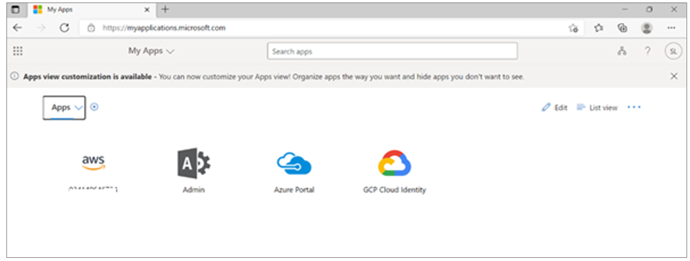

# Post onboarding instructions

<!-- tabs:start -->

### **macOS**

  
a. Enable Full Disk Access(FDA) for the applications installed for SEED
 

  1. Go to the **Apple** menu > **System Preferences** > **Security & Privacy**.
  2. Click the **Privacy** tab.
  3. From the left pane, choose **Full Disk Access**.
  4. Click the lock icon at the bottom and use your Touch ID or enter your  password to unlock.

  

  
If you are unable to access this preference with your current password, complete the following steps to reset your device password.

 <ol>

  <li>Go to the <b>Apple</b> menu > <b>Lock Screen</b> or use keyboard shortcut <b>Command+Control+Q</b> .</li>
  <li>Enter your password and press <b>return</b>. You will be prompted to reset password.</li>
  <li>Reset your password.</li>
  </ol>
  

  5. Ensure the following applications are listed:
       - Tanium Client
       - Microsoft Intune Agent
       - Microsoft Defender
       - Microsoft Defender ATP Security Extension <!--Microsoft Defenders Endpoint Security Extension-->

?>  If any of the listed application is missing, please refer to [Common onboarding issues for macOS users](faqs/common-onboarding-issues).

  6. Select the checkboxes beside these applications.

   <kbd></kbd>

  
b. Enrol on Cloudflare using WARP client to connect to protected engineering resources
 

  1. Ensure that you have Cloudflare WARP client installed in your device. If not, install the latest [Cloudflare WARP](https://install.appcenter.ms/orgs/cloudflare/apps/1.1.1.1-macos-1/distribution_groups/release) version.

  2. Disconnect from any other VPN that might be running as that could clash with Cloudflare.

  3. Open the Cloudflare WARP client from the menu bar on the top right corner of your Mac device.

  <kbd></kbd>

  ?>  You can also press ``Command+Spacebar`` and search for  **Cloudflare WARP** application to open it.

 You will see the information page, followed by your privacy policy.

  4. Click **Next** and then **Accept**.

  <kbd></kbd>

  5. When prompted to sign in, select **Azure AD – TechPass Prod**.

  

  ?>  If you encounter an error stating that user account does not exist in the respective tenant, open a new tab and go to [https://myaccount.microsoft.com](https://myaccount.microsoft.com/), sign out from your account and then retry.

  6. Sign in using your TechPass credentials.

  

  ?> If you are a public officer, you need to authorise your WOG sign-in first. To authorise that, enter the six-digit one-time password code displayed under your SG Govt M365 account on your authenticator app and then proceed to authorise your TechPass account.

  7. Once you have successfully signed in, click the Cloudflare WARP icon.

  <kbd></kbd>

  The following screen is displayed.

  <kbd></kbd>

  ?>  If you need to connect to a different VPN, disconnect and quit from the WARP client.

#### **Windows**

  
a. Enrol on Cloudflare using WARP client to connect to protected engineering resources
 

1. Click the **Show hidden icons** arrow next to the notification area and make sure that Cloudflare WARP icon is displayed on your device or go to the **Start** menu and search for **Cloudflare WARP**.

<kbd></kbd>

?> If it is not available on your device, install it from [Cloudflare App Center](https://install.appcenter.ms/orgs/cloudflare/apps/1.1.1.1-windows-1/distribution_groups/release).

2. Disconnect from any other VPN that might be running as that could clash with Cloudflare.

3. Run the Cloudflare WARP client. You will see an information page, followed by a privacy policy.

4. Click **Next** and accept the policy.

<kbd></kbd>

3. When prompted to sign in, choose **Azure AD – TechPass Prod**.

5. Sign on using your TechPass credentials.

6. Approve your TechPass login using the authenticator app that was used to set up TechPass MFA. However, if you are a public officer, you must first approve your WOG login before approving your Techpass login.

<kbd></kbd>

6. Once you have successfully signed in, click the Cloudflare WARP icon. You should see the following page.

<kbd></kbd>

?> The WARP client connects your device to the Cloudflare network, which functions like a VPN. If you want to connect to a different VPN, first disconnect from WARP and exit it before doing so. If you do not exit the WARP client, it will attempt to automatically reconnect every hour and this may affect your existing VPN connection.

<!-- tabs:end -->

## Verification steps for GCC 1.0 users

This article is for GCC 1.0 users who have onboarded their non-GSIB device to SEED. When your device is onboarded to SEED it becomes a Government Managed Device (GMD).

Objective of this document is to explain how to verify if your device onboarding to SEED was successful and if you are still able to access your GCC 1.0 resources.

*To verify SEED onboarding for GCC 1.0 users*:
1.	As only one VPN connection can be active at a time, go to the Cloudflare WARP icon on your GMD and toggle the **Connected** switch to **Paused**.

<kbd></kbd>

?> Cloudflare will automatically reconnect after three hours.

2. Launch and connect the GlobalProtect VPN client using your VPN ID and password.
<kbd></kbd>

3. Go to [myapplications.microsoft.com](https://myapplications.microsoft.com/) and log in with your Cloud ID and password.

4. Verify if you are able to access GCC 1.0 resources successfully.

?> The above image is an example and your actual GCC 1.0 resources may vary based on your account.

5. To verify if you are able to access the DEEP dashboard, click **Disconnect** in the GlobalProtect VPN client.

6. Click the Cloudflare WARP icon and toggle the switch from **Paused** to **Connected**. If the Cloudflare WARP for Teams appears as shown below, it indicates that you are connected to Cloudflare WARP and can access the DEEP dashboard using it.

7. Go to the [DEEP dashboard](https://deep.tech.gov.sg).

<kbd></kbd>

8. Choose **Azure AD TechPass Prod**.
9. When prompted, log in with your TechPass account.

<kbd></kbd>

?> If you are public officer, you may have to authenticate your WOG account first by using the one-time password code displayed under your SG Govt M365 profile in the Authenticator app.

10. In the **DEEP** login page, click **Sign in with TechPass**.

<kbd></kbd>

You will be directed to your DEEP dashboard.

