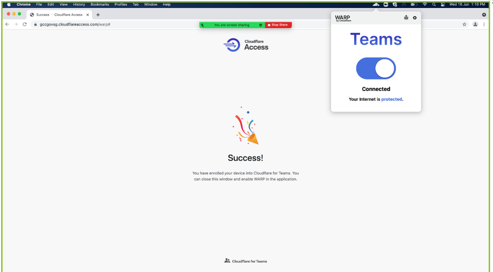

# Post onboarding instructions for macOS 11 and 12

  After you onboard your Internet Device to SEED: 

  - [Ensure Full Disk Access(FDA) is enabled for SEED components](#ensure-full-disk-accessfda-is-enabled-for-seed-components)
  - [Turn on Cloudflare WARP for macOS](#turn-on-cloudflare-warp-for-macos)

## Ensure Full Disk Access(FDA) is enabled for SEED components

After onboarding, ensure FDA is enabled for the following SEED components:

  - Tanium Client
  - Microsoft Intune Agent
  - Microsoft Defender
  - Microsoft Defender ATP Security Extension 

### To verify FDA is enabled for the SEED components

1. Go to the **Apple** menu > **System Preferences** > **Security & Privacy**.
2. Click the **Privacy** tab.
3. From the left pane, choose **Full Disk Access**.
4. Click the lock icon at the bottom and use your Touch ID or enter your  password to unlock.

?> **Note** If you were not prompted to reset device password while onboarding, you will be prompted now. See FAQ for password policy.

5. Ensure the following applications are listed:
    - Tanium Client
    - Microsoft Intune Agent
    - Microsoft Defender
    - Microsoft Defender ATP Security Extension 

?> **Note** If a SEED component is missing, see [Common onboarding issues for macOS users](faqs/common-onboarding-issues).

6. Ensure the checkboxes beside these applications are selected.

  

## Turn on Cloudflare WARP for macOS

When you onboard your Internet Device to SEED, Cloudflare WARP is installed on it. You need to turn it on to protect your internet connection.

### To turn on Cloudflare WARP for macOS

1. Open the Cloudflare WARP client from the menu bar.

 
  
You will see the information page, followed by the privacy policy.

2. Click **Next**, and then **Accept** to agree to Cloudflare’s privacy policy.

3. When prompted to sign in, select **Azure AD – TechPass Prod**.

!>**Note**  If you encounter an error stating that user account does not exist in the respective tenant, open a new tab and go to [https://myaccount.microsoft.com](https://myaccount.microsoft.com/), sign out from your account and then retry.

4. Sign in using your TechPass credentials.

5. After successfully signing in, click **Open Cloudflare WARP.app** to get your WARP connected.

When it is connected, you should see the WARP Zero Trust in the connected state.
  

6. Open Cloudflare WARP **Settings**, and make sure **Gateway with WARP** is selected.

WARP is now running and protecting your Internet connection.
  

<!--

After onboarding to SEED, enrol your device with Cloudflare using WARP client to connect to protected engineering resources.

**To enrol with Cloudflare WARP:**

  1. Ensure that you have Cloudflare WARP client installed in your device. If not, install the latest [Cloudflare WARP](https://install.appcenter.ms/orgs/cloudflare/apps/1.1.1.1-macos-1/distribution_groups/release) version.

  2. Disconnect from any other VPN that might be running as that could clash with Cloudflare.

  3. Open the Cloudflare WARP client from the menu bar on the top right corner of your Mac device.

  <kbd></kbd>

  ?>  You can also press ``Command+Spacebar`` and search for  **Cloudflare WARP** application to open it.

 You will see the information page, followed by your privacy policy.

  4. Click **Next** and then **Accept**.

  <kbd></kbd>

  5. When prompted to sign in, select **Azure AD – TechPass Prod**.

  

  ?>  If you encounter an error stating that user account does not exist in the respective tenant, open a new tab and go to [https://myaccount.microsoft.com](https://myaccount.microsoft.com/), sign out from your account and then retry.

  6. Sign in using your TechPass credentials.

  

  ?> If you are a public officer, you need to authorise your WOG sign-in first. To authorise that, enter the six-digit one-time password code displayed under your SG Govt M365 account on your authenticator app and then proceed to authorise your TechPass account.

  7. Once you have successfully signed in, click the Cloudflare WARP icon.

  <kbd></kbd>

  The following screen is displayed.

  <kbd></kbd>

  ?> The WARP client connects your device to the Cloudflare network, which functions like a VPN. If you want to connect to a different VPN, first turn off WARP connection before connecting to other VPN network. WARP will be automatically turned on after three hours and this will affect your other VPN connections.

  -->
