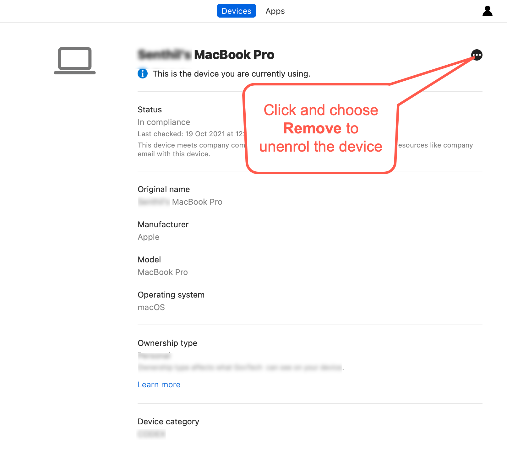

# Offboarding from SEED for macOS

This section guides the existing SEED users to offboard from it. The offboarding journey has the following steps:


<details>
  <summary>a. Remove your device from Intune</summary><br>

  1. Open the **Company Portal** application and click **Sign in**.

  <kbd></kbd>

  2. Log in using your TechPass account credentials.
     <!--- If you are a public officer, use your [WOG ID](terms-definitions).
     - If you are a vendor, use your [TechPass ID](terms-definitions).-->

     <kbd></kbd>

     ?> If you're using text message method for authentication, after you enter your password, you'll need to enter the verification code sent to your phone. Based on what you [set up](https://account.activedirectory.windowsazure.com/Proofup.aspx), other authentication methods have different ways to perform the 2FA.

  3. Go to **Devices** and click the three dots beside the device you want to unenrol.
  4. Choose **Remove**.

  <kbd></kbd>
  5. When prompted to confirm the removal, select **Remove**.
  6. Click your profile icon and **Sign out** of **Company Portal**.


</details>

<details>
  <summary>b. Remove Tanium Client</summary><br>

  1. Open the **Terminal** app and run the following commands:

  ```
  sudo launchctl unload /Library/LaunchDaemons/com.tanium.taniumclient.plist

  sudo launchctl remove com.tanium.taniumclient \&gt; /dev/null 2\&gt;&amp;1

  sudo rm /Library/LaunchDaemons/com.tanium.taniumclient.plist

  sudo rm /Library/LaunchDaemons/com.tanium.trace.recorder.plist

  sudo rm -rf /Library/Tanium/

  sudo rm /var/db/receipts/com.tanium.taniumclient.TaniumClient.pkg.bom

  sudo rm /var/db/receipts/com.tanium.taniumclient.TaniumClient.pkg.plist

  sudo rm /var/db/receipts/com.tanium.tanium.client.bom

  sudo rm /var/db/receipts/com.tanium.tanium.client.plist
  ```
2. Enter your macOS password when prompted.  

</details>

<details>
  <summary>c. Remove Cloudflare WARP client</summary><br>

  Complete the following steps to remove Cloudflare WARP Client:

  1. Open the **Terminal**app and run the following command.

  ```
  sudo /bin/sh /Applications/Cloudflare\ WARP.app/Contents/Resources/uninstall.sh
  ```
  2. Enter your macOS password when prompted.

  </details>

  <details id="removeMicrosoftDefenderATPoffBoarding">
  <summary>d. Remove Microsoft Defender ATP</summary><br>

  To remove Microsoft Defender ATP from your device, first you need to offboard from it using the offboarding script.

  Check if the script that you received earlier has not yet expired.

 ?>  The expiry date is indicated on the file name. For example, *MicrosoftDefenderATPOffboardingMacOs_valid_until_2021-11-04.py*

  If the script has already expired, choose one of the below options as appropriate:

  - If you are a public officer, contact [SEED team](mailto:gcc2.0_support@tech.gov.sg) to get the offboarding script.

  - If you are a vendor, contact your Defender ATP administrator to [get the offboarding script](get-offboarding-scripts-for-microsoft-defender-atp).

  Once you have the valid offboarding script, do the following to remove Microsoft Defender ATP:

1. Save the offboarding script in the **Downloads** folder.
2. Go to the **Terminal** and run the following command:
  ```
  sudo python ~/Downloads/name_of_offboarding_script.py
  ```
3. Click the **Finder** icon in the **Dock**.
4. Choose **Applications** and search for **Microsoft Defender for Endpoint.app**.
5. Drag the app to the Trash, or select the app and choose **File** > **Move to Trash**.


</details>

<!--


  To offboard from Microsoft Defender ATP, you need the offboarding scripts.

  Check if the scripts that you received during [remove existing softwares](seed-pre-onboarding-clean-up-instructions-for-macos) are still valid and not yet expired. The expiry date is indicated on the file name. For example, *MicrosoftDefenderATPOffboardingMacOs_valid_until_2021-11-04.py*

  If the scripts have already expired, choose one of the below options as appropriate:

  - If you are a public officer, [contact GCC2.0 team](gcc2.0_support@tech.gov.sg) to get the offboarding scripts.

  - If you are a vendor, contact your Defender ATP administrator to get the offboarding scripts.


  Once you have the offboarding scripts, proceed to Remove Microsoft Defender ATP.

</details>

<details>
  <summary>Get offboarding scripts for Microsoft Defender ATP</summary><br>
  1. Go to [Defender Security Center portal](https://securitycenter.windows.com/).

  2. Click **Settings** > **Device Management** > **Offboard**.

  3. Select *macOS* as operating system and *Local Script* as **Deployment Method**.

  4. Download the script from the compressed file, a .zip file, and share it with the vendor(s).

  ?> The offboarding scripts expire after the  date indicated on the file name. For example, *MicrosoftDefenderATPOffboardingMacOs_valid_until_2021-11-04.py*

</details>-->


<!--**Objective:** This section guides existing macOS SEED users to offboard their devices.

Audience: Existing SEED users-->
