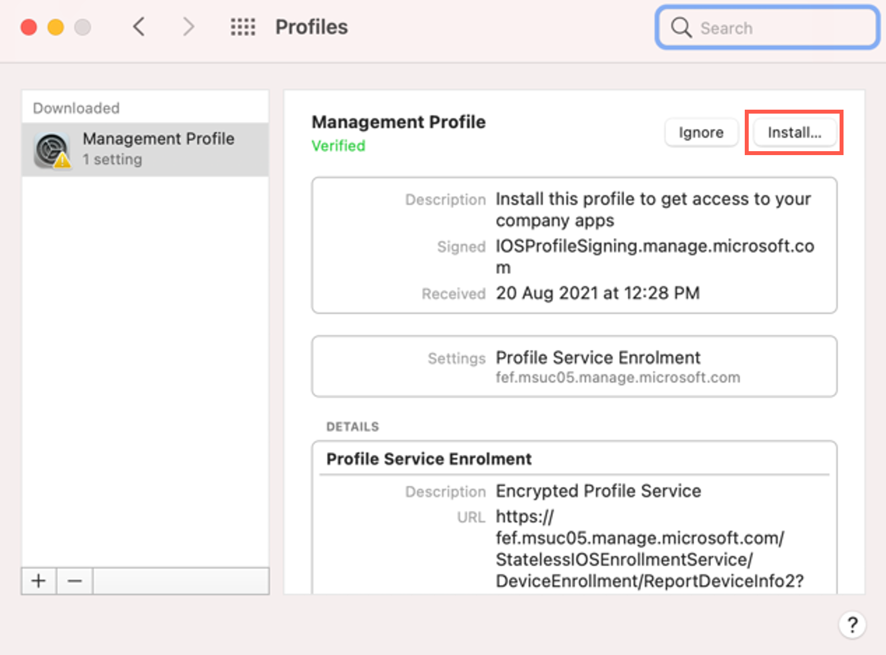
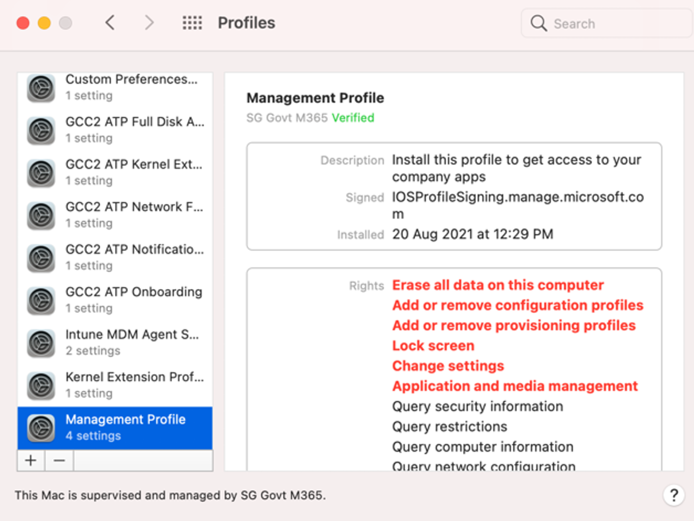
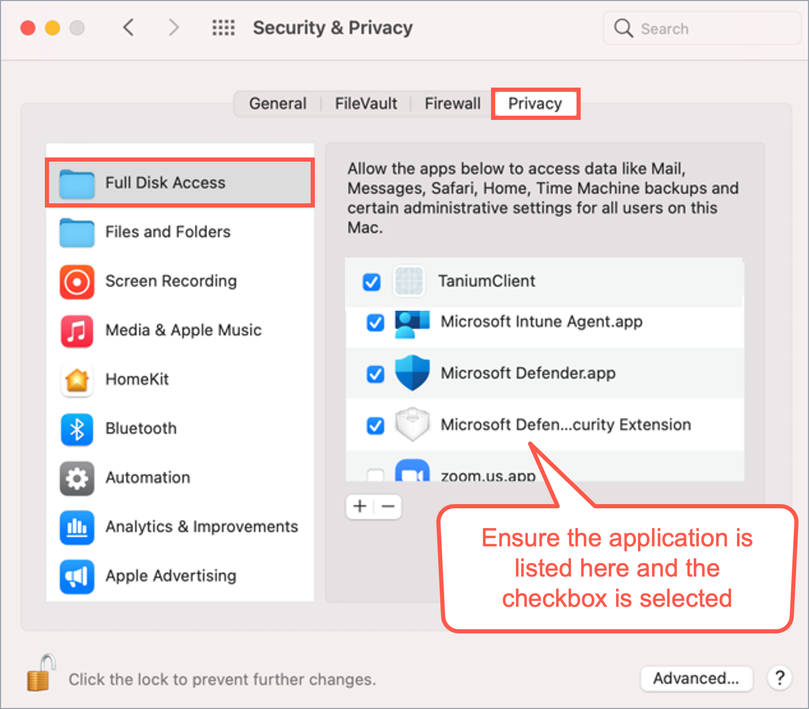
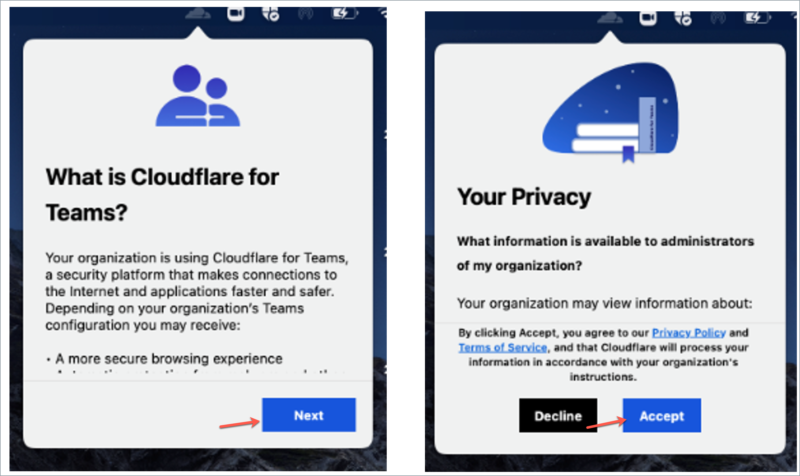
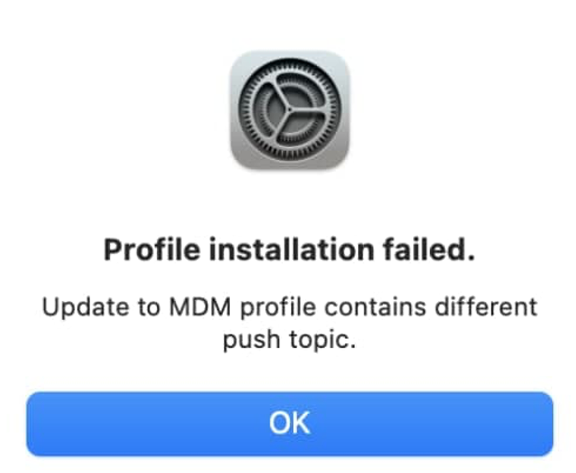

# Onboarding to SEED using macOS

This sections explains public officers and vendors  how to onboard to SEED using macOS.

?>  Based on your Mac settings, you may be prompted to restart or reset your password while onboarding.

During this onboarding journey you will do the following:

  
a. Set up Intune
 

  1. Download and install [**Company Portal**](https://go.microsoft.com/fwlink/?linkid=853070).

  2. Open the **Company Portal** application and click **Sign in**.

  <kbd></kbd>

  3. Log in using your TechPass account credentials.
  <!-- the appropriate login credentials to sign in with two-factor authentication:
     - If you are a public officer, use your [WOG ID](terms-definitions).
     - If you are a vendor, use your [TechPass ID](terms-definitions). -->

  <kbd></kbd>

  ?> If you're using the text message method for authentication, after you enter your password, you'll need to enter the verification code sent to your phone. Based on what you [set up](https://account.activedirectory.windowsazure.com/Proofup.aspx), other authentication methods have different ways to perform the 2FA.

  4. Once you have signed in, click **Begin**.

  <kbd></kbd>

  5. Review privacy information. Then click **Continue**.

  <kbd></kbd>

  6. On the **Install management profile** page, click **Download profile**.

  <kbd></kbd>

  7. Follow the on-screen instructions to allow Microsoft Intune to manage your device. The **Profiles** page is displayed.

  <kbd></kbd>

  Tip:
   - If **Profiles** page is not displayed, go to the **Apple** menu > **System Preferences** > **Profiles**.

   - If **Management Profile** is not displayed, then from the left side menu, select **Management Profile**.

   - If Profile installation fails, refer to [Common issues while onboarding using macOS](#common-issues-while-onboarding-using-macos).

  8. Click **Install**.

  <kbd></kbd>

  The configuration profiles that Intune needs to deploy will be installed. You will see a list of profiles as shown below.

  <kbd></kbd>

  9. Open the **Company Portal** application again.

  <!---->

  10. You will see the success message. Click **Done**.

  <kbd></kbd>

  <!--?> Onboarding is not yet complete. Now you proceed to verify if System Integrity Protection(SIP) is enabled on your device. SIP protects your system from the execution of unauthorised code.-->

  
b. Enable System Integrity Protection (SIP)
 

  - To verify if SIP is enabled, open **Terminal** and run the command `csrutil status`.

   If the response on your **Terminal** is `System Integrity Protection status: enabled`, it indicates that SIP is already enabled on your Mac.

   ?>  If it is currently disabled, run the command `csrutil enable` on the **Terminal** and restart your device before proceeding further.

  
c. Encrypt your hard disk
 

  1. Go to the **Apple** menu > **System Preferences** > **Security & Privacy**.
  2. Click the **FileVault** tab.
  3. If you see **Turn on FileVault**, go to step 4 or proceed to **Enable Full Disk Access(FDA)**.
  4. Click the lock icon and use your Touch ID or enter your password to unlock.
  5. Click **Turn on FileVault**.
  6. You will be prompted to specify how you would like to unlock your device if you forget your device password. Select **Create a recovery key and do not use my iCloud account**.

  <kbd></kbd>

   ?>  Save this key on a different device.

  
d. Enable Full Disk Access(FDA)
 

  1. Go to the **Apple** menu > **System Preferences** > **Security & Privacy**.
  2. Click the **Privacy** tab.
  3. From the side menu, choose **Full Disk Access**.
  4. Click the lock icon at the bottom and use your Touch ID or enter your  password to unlock.
  5. Ensure the following applications are listed:
       - Tanium Client
       - Microsoft Intune Agent
       - Microsoft Defender ATP
       - Microsoft Defender ATP Security Extension

   ?>  If **TaniumClient** is missing, refer to [Common issues while onboarding using macOS](#common-issues-while-onboarding-using-macos) before proceeding further. If any other applications are missing, please wait for approximately four hours for them to appear. If they are still not available, please contact gcc2.0_support@tech.gov.sg

  6. Select the checkboxes beside these applications.

   <kbd></kbd>

  
e. Enrol on Cloudflare using WARP client
 

  1. Ensure that you have Cloudflare WARP client installed in your device. If not, install it from [https://install.appcenter.ms/orgs/cloudflare/apps/1.1.1.1-macos-1/distribution_groups/release](https://install.appcenter.ms/orgs/cloudflare/apps/1.1.1.1-macos-1/distribution_groups/release).

  2. Disconnect from any other VPN that might be running as that could clash with Cloudflare.

  3. Open the Cloudflare WARP client from the menu bar on the top right corner of your Mac device.

  <kbd></kbd>

  ?>  You can also press ``Command+Spacebar`` and search for  **Cloudflare WARP** application to open it.

 You will see the information page, followed by your privacy policy.

  4. Click **Next** and then **Accept**.

  <kbd></kbd>

  5. When prompted to sign in, select **Azure AD – TechPass Prod**.

  <kbd></kbd>

  ?>  If you encounter an error stating that user account does not exist in the respective tenant, open a new tab and go to [https://myaccount.microsoft.com](https://myaccount.microsoft.com/), sign out from your account and then retry.

  6. Sign in using your TechPass credentials.

   <!--When greeted with the Microsoft sign-in page, sign in using your WOG ID (i.e. [your\_name@tech.gov.sg](mailto:your_name@tech.gov.sg)) if you are a public officer, or your TechPass ID (i.e. [your\_name@techpass.gov.sg](mailto:your_name@techpass.gov.sg)) if you are a vendor.-->

  <kbd></kbd>

  7. Once you have successfully signed in, click the Cloudflare WARP icon.

  <kbd></kbd>

  The following screen is displayed.

  <kbd></kbd>

  ?>  If you need to connect to a different VPN, disconnect and quit from the WARP client.

<!--3. [Ensure your device hard disk is encrypted](#ensure-your-device-hard-disk-is-encrypted).
4. [Enable Full Disk Access(FDA)](#enable-full-disk-access).
5. [Enrol your macOS on Cloudflare using WARP client](#enrol-your-macos-on-cloudflare-using-warp-client)

<!--?> If you encounter any issues while onboarding, refer to [Common issues and resolution](#common-issues-and-resolution) section in the appendix before reaching out to the SEED team for support.-->

<!--## Get your macOS device managed by Intune Company Portal app
Enrol your macOS device with the Intune Company Portal app to get a secured access to your email, files, and applications.

*To manage your device by Intune Company Portal app* :

## Ensure SIP is enabled on your device
Make sure SIP is enabled to prevent executions of unauthorised codes.

## Ensure your device hard disk is encrypted
To protect the privacy of your files and user data secured, ensure your device hard disk is encrypted.

*To ensure your device hard disk is encrypted* :-->

<!--Note:

- Some applications that SEED depends on require Full Disk Access (FDA) in order to function.
- As of Catalina, users may be required to give explicit consent for FDA.

## Enable Full Disk Access
Enable Full Disk Access is for TaniumClient, Microsoft Defender ATP and Microsoft Defender ATP Security Extension.
*To enable FDA* :

## Enrol your macOS on Cloudflare using WARP client-->

<!--- If you encounter any issues during onboarding, refer to [Common issues and resolution](#common-issues-and-resolution) before reaching out to the SEED team.-->

 If your onboarding is successful, within an hour, you will receive a successfully onboarded email to the email address that was used for creating your TechPass account.

?>  If you do not receive this email, please  [contact SEED team](gcc2.0_support@tech.gov.sg).

Shortly after this email, when you receive a desktop notification prompting to restart the device, do the following:

1. Restart your device.
2. If prompted to enter your password, enter it.

?>  While restarting, you will be notified that your device is renamed and will be prompted to reset your password.

3. Reset your password.

<!--that **your device has been renamed and will restart in 5 minutes**. This is expected, and the rename is required for SEED to function properly. **Please do not change your device name thereafter**.-->

## Common issues while onboarding using macOS

  
1. What should I do if profile installation fails while installing the management profile?
 

  <kbd></kbd>

    1. Go to the **Apple** menu > **System Preferences** > **Profiles**.
    2. If **Management Profile** is already an existing profile, select it and remove by clicking the minus icon at the bottom left corner.

  
2. While enabling FDA, I can't find <b>TaniumClient</b>. What should I do?
 

  1. Open the **Terminal** application and run the command: ``sudo chmod 755 /Library/Tanium/TaniumClient``.
  2. Go to the **Apple** menu > **System Preferences** > **Security & Privacy**.
  3. Click the **Privacy** tab.
  4. From the side menu, choose **Full Disk Access**.
  5. Click the lock icon at the bottom and use your Touch ID or enter your password to unlock.
  6. Click the plus icon at the bottom and from **Applications**, select **TaniumClient**.
  7. Select the checkbox beside **TaniumClient**.

