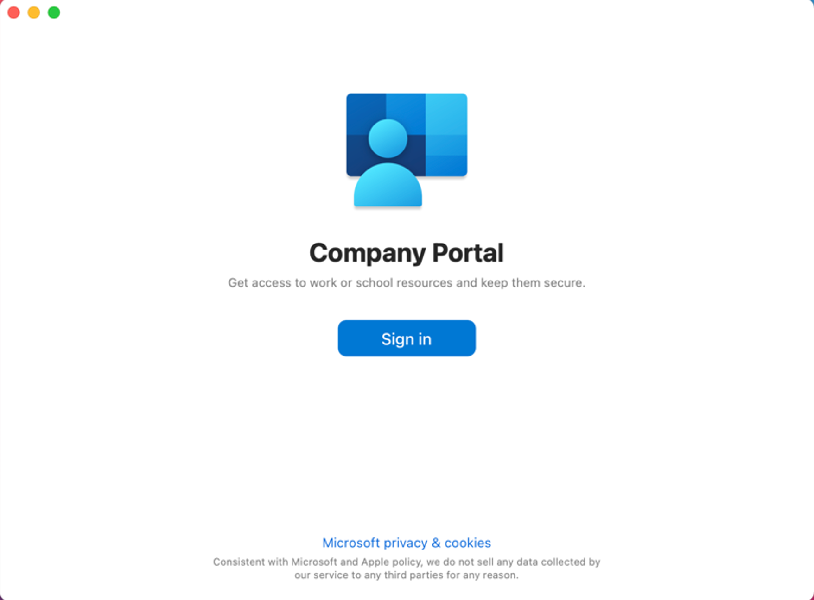
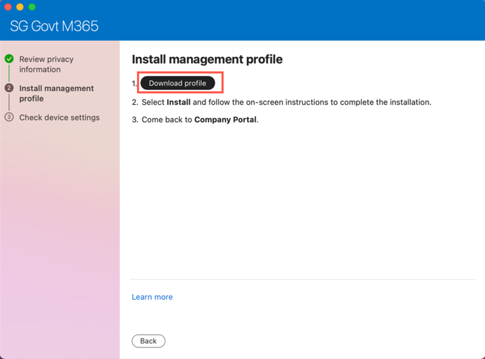

# SEED onboarding guide for macOS users

This sections explains how public officers and vendors can onboard to SEED using their macOS device. Before onboarding, take a look at the [prerequisites for SEED onboarding](prerequisites-for-onboarding).

!> Note: Based on your device settings, while onboarding, you may be prompted to **restart your device** a couple of times and **reset device password**. For a smooth onboarding journey, it is important to link your Apple ID to your device. Please have your recovery keys ready in the event of you facing issues with resetting your password or logging in to your device.

During this onboarding journey you will do the following:

## Step 1. Set up Microsoft Endpoint Manager

  
Set up Microsoft Endpoint Manager to get the required applications and device configuration
 

  1. Download and install [**Company Portal**](https://go.microsoft.com/fwlink/?linkid=853070).

  2. Open the **Company Portal** application and click **Sign in** to log in using your TechPass credentials.

  

  3. Approve your TechPass login using the authenticator app that was used to set up TechPass MFA. However, if you are a public officer, you must first approve your WOG login before approving your Techpass login.

  <kbd></kbd>

  ?> The above page is displayed only for public officers. Refer to [TechPass documentation](https://docs.developer.tech.gov.sg/docs/techpass-user-guide/#/) for more information.

  4. Once you have signed in, click **Begin**.

  <kbd></kbd>

  5. Review privacy information. Then click **Continue**.

  <kbd></kbd>

  6. On the **Install management profile** page, click **Download profile**.

  <kbd></kbd>

  7. Follow the on-screen instructions to allow Microsoft Endpoint Manager to manage your device. The **Profiles** page is displayed.

  <kbd></kbd>

  Tip:
   - If **Profiles** page is not displayed, go to the **Apple** menu > **System Preferences** > **Profiles**.

   - If **Management Profile** is not displayed, then from the left side menu, select **Management Profile**.

   - If Profile installation fails, refer to [Common issues while onboarding using macOS](common-issues-while-onboarding-using-macos).

  8. Click **Install**.

  <kbd></kbd>

  The configuration profiles that Microsoft Endpoint Manager needs to deploy will be installed. You will see a list of profiles as shown below.

  <kbd></kbd>

  9. Open the **Company Portal** application again.

  10. You will see the success message. Click **Done**.

  <kbd></kbd>

## Step 2. Enable System Integrity Protection (SIP)

  
Enable System Integrity Protection (SIP) to prevent unauthorised code executions
 

  - To verify if SIP is enabled, open **Terminal** and run the command `csrutil status`.

   If the response on your **Terminal** is `System Integrity Protection status: enabled`, it indicates that SIP is already enabled on your Mac.

  Note:  If it is currently disabled, run the command `csrutil enable` on the **Terminal** and restart your device before proceeding further.

## Step 3. Encrypt your hard disk

  
Encrypt your hard disk to protect your data at rest
 

  1. Go to the **Apple** menu > **System Preferences** > **Security & Privacy**.
  2. Click the **FileVault** tab.
  3. If you see **Turn on FileVault**, go to step 4 else proceed to **Enable Full Disk Access(FDA)**.
  4. Click the lock icon and use your Touch ID or enter your password to unlock.

?> Reset your device password if you are unable to access this preference with your current password.

  5. Click **Turn on FileVault**.
  6. When prompted to specify how you would like to unlock your device if you forget your device password,  select **Create a recovery key and do not use my iCloud account**.

  <kbd></kbd>

   ?>  Save this key on a different device.

## Step 4. Enable Full Disk Access(FDA)

  
Enable Full Disk Access(FDA) for the applications installed for SEED
 

  1. Go to the **Apple** menu > **System Preferences** > **Security & Privacy**.
  2. Click the **Privacy** tab.
  3. From the left pane, choose **Full Disk Access**.
  4. Click the lock icon at the bottom and use your Touch ID or enter your  password to unlock.
  5. Ensure the following applications are listed:
       - Tanium Client
       - Microsoft Endpoint Manager Agent
       - Microsoft Defender
       - Microsoft Defenders Endpoint Security Extension

   ?>  If any of the listed application is missing, please refer to [Common issues while onboarding using macOS](common-issues-while-onboarding-using-macos).

  6. Select the checkboxes beside these applications.

   <kbd></kbd>

## Step 5. Enrol on Cloudflare using WARP client

  
Enrol on Cloudflare using WARP client to connect to protected engineering resources
 

  1. Ensure that you have Cloudflare WARP client installed in your device. If not, install the latest [Cloudflare WARP](https://install.appcenter.ms/orgs/cloudflare/apps/1.1.1.1-macos-1/distribution_groups/release) version.

  2. Disconnect from any other VPN that might be running as that could clash with Cloudflare.

  3. Open the Cloudflare WARP client from the menu bar on the top right corner of your Mac device.

  <kbd></kbd>

  ?>  You can also press ``Command+Spacebar`` and search for  **Cloudflare WARP** application to open it.

 You will see the information page, followed by your privacy policy.

  4. Click **Next** and then **Accept**.

  <kbd></kbd>

  5. When prompted to sign in, select **Azure AD – TechPass Prod**.

  

  ?>  If you encounter an error stating that user account does not exist in the respective tenant, open a new tab and go to [https://myaccount.microsoft.com](https://myaccount.microsoft.com/), sign out from your account and then retry.

  6. Sign in using your TechPass credentials.

  

  ?> If you are a public officer, you need to authorise your WOG sign-in first. To authorise that, enter the six-digit one-time password code displayed under your SG Govt M365 account on your authenticator app and then proceed to authorise your TechPass account.

  7. Once you have successfully signed in, click the Cloudflare WARP icon.

  <kbd></kbd>

  The following screen is displayed.

  <kbd></kbd>

  ?>  If you need to connect to a different VPN, disconnect and quit from the WARP client.

If your onboarding is successful, within an hour, you will receive a successfully onboarded email to  your organisational email address.

  <ul>
      <li>If you do not receive this email, [check if Microsoft Defender is configured correctly](verify-microsoft-defender-is-configured-correctly-for-your-os) and also check if Tanium and Cloudflare are installed. If Tanium or Cloudflare is not installed, please contact <a href="mailto:gcc2.0_support@tech.gov.sg">SEED team</a>.</li>
      <li>Shortly after this email, you will receive a desktop notification informing you that your device has been renamed and will automatically restart in the next five minutes. When you log in again, you will be prompted to reset your password. This is to enforce a strong password policy.</li>
      <li>If you had reset your password while onboarding, you will not be prompted to reset password when your device automatically restarts.</li>
      </ul>
  

!> Note:  As Safari is not supported by SEED, use Google Chrome or Microsoft Edge for accessing services or websites that need SEED.
